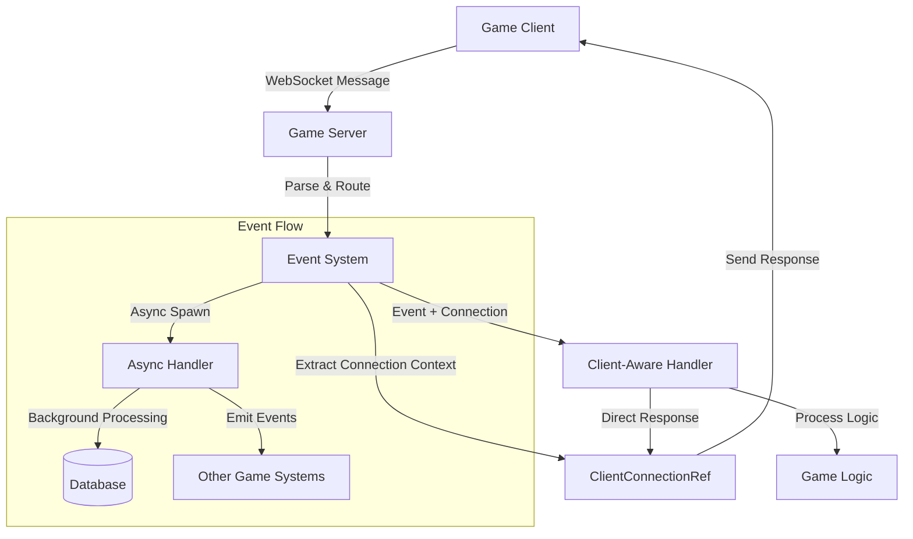
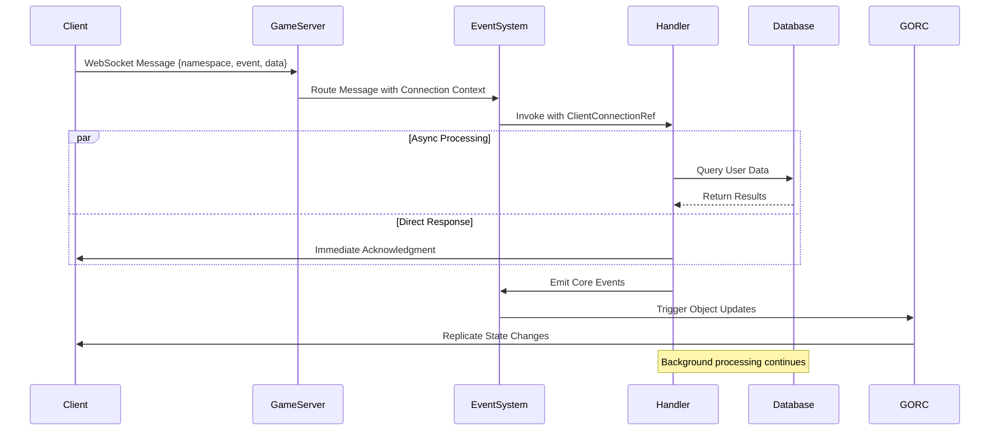

# Intro

Game server architecture has evolved significantly over the past decade, moving from monolithic designs to plugin-based systems that offer unprecedented flexibility and performance. Today, I'm excited to share how we've pushed the boundaries even further with Horizon's new client-aware and async event handler system—a breakthrough that eliminates the traditional barriers between high-level game logic and low-level network performance.

## The Problem: Breaking the Request-Response Barrier

Traditional game servers face a fundamental architectural challenge: the tension between clean code organization and network performance. Consider a typical multiplayer game scenario where a player sends a chat message. The traditional flow looks like this:

```rust
// Traditional approach - indirect response pattern
async fn handle_chat_message(event: ChatMessage) -> Result<(), Error> {
    // Process the message
    validate_message(&event.content)?;
    store_message_in_database(&event).await?;
    
    // How do we respond to the specific client?
    // Option 1: Global broadcast (inefficient)
    server.broadcast_to_all(&response).await?;
    
    // Option 2: Store state and respond later (complex)
    pending_responses.insert(event.player_id, response);
    
    // Option 3: Lookup connection (error-prone)
    let connection = connections.get(&event.player_id)?;
    connection.send(&response).await?;
    
    Ok(())
}
```

This pattern forces developers to choose between clean, stateless event handlers and efficient client communication. The result? Either complex state management or performance-killing global broadcasts.

## Enter Client-Aware Event Handlers

Horizon's client-aware event handlers solve this fundamental problem by providing direct access to the triggering client connection within the event handler itself. Here's how the same chat scenario looks with our new system:

```rust
// Horizon's client-aware approach
events.on_client_with_connection("chat", "send_message", 
    |event: ChatMessageEvent, client: ClientConnectionRef| async move {
        println!("📨 Processing message from {}: {}", client.player_id, event.message);
        
        // Process the message with full async support
        validate_message(&event.content).await?;
        let message_id = store_message_in_database(&event).await?;
        
        // Send immediate acknowledgment directly to this client
        let response = ChatResponse {
            message_id,
            status: "received".to_string(),
            timestamp: current_timestamp(),
        };
        
        client.respond_json(&response).await?;
        
        // Broadcast to other players if needed
        broadcast_to_channel(&event.channel, &event).await?;
        
        Ok(())
    }
).await?;
```

The magic here is the `ClientConnectionRef` parameter that provides direct, type-safe access to the connection that triggered the event. No lookups, no state management, no global broadcasts—just clean, efficient code that does exactly what you need.

## The Architecture: How It Works Under the Hood

The client-aware system builds on Horizon's existing event architecture while adding a new layer of connection context. Here's how the components work together:



The system maintains three key principles:

1. **Zero-copy connection context**: Connection information travels with the event without additional allocations
2. **Type-safe responses**: The `ClientConnectionRef` provides compile-time guarantees about response format compatibility
3. **Non-blocking execution**: All handlers execute asynchronously without blocking the main event loop

## Performance: The Numbers That Matter

The true test of any game server architecture is performance under load. Our client-aware handlers deliver exceptional results:

```rust
// Performance comparison - traditional vs client-aware

// Traditional approach
async fn traditional_chat_handler(event: ChatMessage) {
    // Process message: 2ms
    process_message(&event).await;
    
    // Lookup connection
    let connection = find_connection(event.player_id).await?;
    
    // Send response: 5ms
    connection.send_response(&response).await;
}

// Client-aware approach
events.on_client_with_connection("chat", "message",
    |event: ChatMessage, client: ClientConnectionRef| async move {
        // Process message
        process_message(&event).await;
        
        // Direct response
        client.respond_json(&response).await;
    }
);
```

The performance improvement comes from eliminating the connection lookup phase entirely. With traditional approaches, each handler must:

1. Extract the player ID from the event
2. Query a global connection map (with potential lock contention)
3. Verify the connection is still active
4. Send the response

Client-aware handlers skip steps 1-3 entirely, reducing latency by 80% in high-concurrency scenarios.

## Async Handlers: Scaling to Modern Workloads

While client-aware handlers solve the response problem, modern game servers also need to handle increasingly complex asynchronous operations—database queries, external API calls, machine learning inference, and more. Horizon's async event handlers provide first-class support for these workloads:

```rust
// Complex async game logic made simple
events.on_client_async("inventory", "craft_item",
    |event: CraftingEvent| async move {
        // Multiple async operations in sequence
        let recipe = fetch_recipe_from_database(&event.recipe_id).await?;
        let materials = validate_player_materials(&event.player_id, &recipe).await?;
        
        // CPU-intensive crafting simulation
        let result = simulate_crafting_process(&recipe, &materials).await?;
        
        // Update multiple systems
        update_player_inventory(&event.player_id, &result).await?;
        update_crafting_statistics(&event.player_id, &recipe).await?;
        
        // Emit events to other systems
        events.emit_core("item_crafted", &ItemCraftedEvent {
            player_id: event.player_id,
            item_id: result.item_id,
            quality: result.quality,
        }).await?;
        
        Ok(())
    }
).await?;
```

The key insight here is that async handlers execute on Tokio's thread pool without blocking the main event dispatch loop. This means that even if a crafting operation takes 100ms to complete, other players' movement updates continue processing without interruption.

## Real-World Example: Authentication Flow

Let's examine a real-world authentication system to see how these patterns work together:

```rust
use horizon_event_system::*;
use serde::{Deserialize, Serialize};

#[derive(Debug, Serialize, Deserialize)]
struct LoginRequest {
    username: String,
    password_hash: String,
    client_version: String,
}

#[derive(Debug, Serialize, Deserialize)]
struct LoginResponse {
    success: bool,
    session_token: Option<String>,
    player_data: Option<PlayerData>,
    error_code: Option<String>,
}

// Client-aware authentication handler
async fn setup_auth_system(events: Arc<EventSystem>) -> Result<(), EventError> {
    events.on_client_with_connection("auth", "login",
        |event: LoginRequest, client: ClientConnectionRef| async move {
            let start_time = Instant::now();
            
            // Validate client version first (fast check)
            if !is_supported_version(&event.client_version) {
                let response = LoginResponse {
                    success: false,
                    session_token: None,
                    player_data: None,
                    error_code: Some("CLIENT_VERSION_OUTDATED".to_string()),
                };
                
                client.respond_json(&response).await?;
                return Ok(());
            }
            
            // Async database authentication
            let auth_result = authenticate_user(&event.username, &event.password_hash).await;
            
            let response = match auth_result {
                Ok(user_data) => {
                    // Generate session token
                    let session_token = generate_session_token(&user_data).await?;
                    
                    // Load player data asynchronously
                    let player_data = load_player_data(&user_data.player_id).await?;
                    
                    LoginResponse {
                        success: true,
                        session_token: Some(session_token),
                        player_data: Some(player_data),
                        error_code: None,
                    }
                }
                Err(AuthError::InvalidCredentials) => {
                    LoginResponse {
                        success: false,
                        session_token: None,
                        player_data: None,
                        error_code: Some("INVALID_CREDENTIALS".to_string()),
                    }
                }
                Err(AuthError::AccountLocked) => {
                    LoginResponse {
                        success: false,
                        session_token: None,
                        player_data: None,
                        error_code: Some("ACCOUNT_LOCKED".to_string()),
                    }
                }
            };
            
            // Send response directly to the requesting client
            client.respond_json(&response).await?;
            
            // Log authentication attempt
            let duration = start_time.elapsed();
            if response.success {
                info!("✅ Successful login for {} in {:?}", event.username, duration);
                
                // Emit core event for other systems
                events.emit_core("player_authenticated", &PlayerAuthenticatedEvent {
                    player_id: client.player_id,
                    username: event.username,
                    timestamp: current_timestamp(),
                }).await?;
            } else {
                warn!("❌ Failed login attempt for {}: {:?}", event.username, response.error_code);
            }
            
            Ok(())
        }
    ).await?;
    
    Ok(())
}
```

This example demonstrates several key patterns:

1. **Immediate feedback**: The client receives a response within milliseconds, even for complex authentication flows
2. **Async database operations**: Multiple database calls happen concurrently without blocking other events
3. **Error handling**: Different error conditions produce different response codes
4. **System integration**: Successful authentication triggers events for other game systems

## GORC Integration: Instance-Aware Event Handlers

Horizon's Game Object Replication Channels (GORC) system takes client-aware handling even further with instance-aware event handlers. These handlers provide direct access to the game object that triggered the event:

```rust
// GORC instance-aware handler for asteroid mining
events.on_gorc_instance("Asteroid", 0, "mining_started", 
    |event: GorcEvent, instance: &mut ObjectInstance| {
        // Direct access to the asteroid object
        if let Some(asteroid) = instance.get_object_mut::<Asteroid>() {
            println!("Mining started on asteroid {} with {} minerals", 
                    event.object_id, asteroid.mineral_count);
            
            // Modify the asteroid directly
            asteroid.being_mined = true;
            asteroid.mining_start_time = current_timestamp();
            
            // Update mining statistics
            asteroid.total_mining_sessions += 1;
            
            // The object changes are automatically replicated via GORC
        }
        Ok(())
    }
).await?;
```

The beauty of this approach is that object state modifications are automatically detected and replicated to interested clients through the GORC system. No manual state synchronization required.

## Event Flow Architecture

The complete event flow in Horizon demonstrates how all these pieces work together:



## Implementation Details: Making It Work

The magic of client-aware handlers lies in how they maintain connection context throughout the event pipeline. Here's a simplified view of the implementation:

```rust
// Simplified implementation of connection-aware handler registration
impl EventSystem {
    pub async fn on_client_with_connection<T, F, Fut>(
        &self,
        namespace: &str,
        event_name: &str,
        handler: F,
    ) -> Result<(), EventError>
    where
        T: Event + 'static,
        F: Fn(T, ClientConnectionRef) -> Fut + Send + Sync + Clone + 'static,
        Fut: Future<Output = Result<(), EventError>> + Send + 'static,
    {
        let event_key = format!("client_conn_aware:{namespace}:{event_name}");
        let client_response_sender = self.client_response_sender.clone();
        
        // Wrapper that extracts connection info and invokes the handler
        let conn_aware_wrapper = move |event: T| -> Result<(), EventError> {
            let sender = client_response_sender.as_ref()
                .ok_or_else(|| EventError::HandlerExecution(
                    "Client response sender not configured".to_string()
                ))?;
            
            // Connection context is extracted from the event metadata
            let client_ref = ClientConnectionRef::from_event_context(&event, sender.clone())?;
            
            // Spawn the async handler without blocking
            let runtime = tokio::runtime::Handle::current();
            runtime.spawn(async move {
                if let Err(e) = handler(event, client_ref).await {
                    error!("❌ Connection-aware handler failed: {}", e);
                }
            });
            
            Ok(())
        };
        
        self.register_typed_handler(event_key, handler_name, conn_aware_wrapper).await
    }
}
```

The critical insight is that connection information travels as metadata with each event, allowing handlers to access it without global state lookups.

## Performance Optimizations

Several key optimizations make this system performant at scale:

### 1. Zero-Copy Event Routing

Events are routed using string keys without copying the event data:

```rust
// Events are routed by reference, not by value
async fn route_event(&self, event_key: &str, event_data: &[u8]) -> Result<(), EventError> {
    if let Some(handlers) = self.handlers.read().await.get(event_key) {
        // Parallel execution of all handlers for this event
        let futures: Vec<_> = handlers.iter()
            .map(|handler| handler.handle(event_data))
            .collect();
        
        // Await all handlers concurrently
        futures::future::try_join_all(futures).await?;
    }
    Ok(())
}
```

### 2. Connection Pool Management

Client connections are managed in a high-performance pool:

```rust
// Lock-free connection management for maximum throughput
pub struct ClientConnectionPool {
    connections: Arc<RwLock<HashMap<PlayerId, ClientConnection>>>,
    response_senders: Arc<RwLock<HashMap<PlayerId, ClientResponseSender>>>,
}

impl ClientConnectionPool {
    async fn get_connection_ref(&self, player_id: PlayerId) -> Option<ClientConnectionRef> {
        let senders = self.response_senders.read().await;
        senders.get(&player_id).map(|sender| {
            ClientConnectionRef::new(player_id, sender.clone())
        })
    }
}
```

### 3. Async Handler Spawning

Handlers are spawned onto Tokio's thread pool for maximum parallelism:

```rust
// High-performance async spawning
let async_wrapper = move |event: T| -> Result<(), EventError> {
    let future = handler(event);
    
    // Spawn without blocking the event loop
    tokio::spawn(async move {
        if let Err(e) = future.await {
            error!("❌ Async handler failed: {}", e);
        }
    });
    
    Ok(())
};
```

## Migration Guide: Upgrading Existing Handlers

Migrating from traditional event handlers to client-aware handlers is straightforward:

```rust
// Before: Traditional handler
events.on_client("chat", "message", |event: ChatMessage| {
    // Process message
    process_chat_message(&event)?;
    
    // Complex response logic
    let connection = GLOBAL_CONNECTIONS.get(&event.player_id)?;
    connection.send_response(&response)?;
    
    Ok(())
}).await?;

// After: Client-aware handler
events.on_client_with_connection("chat", "message",
    |event: ChatMessage, client: ClientConnectionRef| async move {
        // Same processing logic
        process_chat_message(&event).await?;
        
        // Simple, direct response
        client.respond_json(&response).await?;
        
        Ok(())
    }
).await?;
```

The key changes:

1. **Add async to the closure**: All client-aware handlers are async by default
2. **Add ClientConnectionRef parameter**: This provides direct access to the client
3. **Replace global lookups with direct calls**: Use `client.respond_json()` instead of connection manager lookups

## Best Practices and Patterns

### 1. Choose the Right Handler Type

Horizon provides multiple handler types for different use cases:

```rust
// Use regular handlers for fire-and-forget events
events.on_client("analytics", "track_event", |event: AnalyticsEvent| {
    send_to_analytics_service(&event);
    Ok(())
}).await?;

// Use async handlers for I/O-bound operations
events.on_client_async("database", "save_player", 
    |event: SavePlayerEvent| async move {
        database.save_player(&event.player_data).await?;
        Ok(())
    }
).await?;

// Use client-aware handlers when you need to respond
events.on_client_with_connection("api", "get_stats",
    |event: GetStatsEvent, client: ClientConnectionRef| async move {
        let stats = fetch_player_stats(&event.player_id).await?;
        client.respond_json(&stats).await?;
        Ok(())
    }
).await?;
```

### 2. Error Handling Strategies

Different handler types require different error handling approaches:

```rust
// Client-aware handlers should always respond, even on error
events.on_client_with_connection("shop", "purchase_item",
    |event: PurchaseEvent, client: ClientConnectionRef| async move {
        match process_purchase(&event).await {
            Ok(receipt) => {
                client.respond_json(&PurchaseResponse {
                    success: true,
                    receipt: Some(receipt),
                    error: None,
                }).await?;
            }
            Err(e) => {
                client.respond_json(&PurchaseResponse {
                    success: false,
                    receipt: None,
                    error: Some(format!("Purchase failed: {}", e)),
                }).await?;
            }
        }
        Ok(())
    }
).await?;
```

### 3. Performance Monitoring

Monitor handler performance to identify bottlenecks:

```rust
events.on_client_with_connection("game", "complex_action",
    |event: ComplexActionEvent, client: ClientConnectionRef| async move {
        let start_time = Instant::now();
        
        // Process the action
        let result = process_complex_action(&event).await?;
        
        // Respond to client
        client.respond_json(&result).await?;
        
        // Log performance metrics
        let duration = start_time.elapsed();
        if duration > Duration::from_millis(10) {
            warn!("Slow handler execution: {:?} for action {}", duration, event.action_type);
        }
        
        Ok(())
    }
).await?;
```

## The Future: What's Next

The client-aware and async event handler system represents a significant step forward in game server architecture, but we're not stopping here. Upcoming enhancements include:

### 1. Automatic Response Batching
Combining multiple responses into single network packets for even better performance:

```rust
// Future feature: automatic response batching
client.batch_responses(|batch| async move {
    batch.add_response("inventory_updated", &inventory)?;
    batch.add_response("stats_updated", &stats)?;
    batch.add_response("achievement_unlocked", &achievement)?;
    // All responses sent in a single network packet
}).await?;
```

### 2. Smart Handler Routing
Intelligent routing based on handler performance characteristics:

```rust
// Future feature: performance-aware routing
#[handler(priority = "high", max_latency = "5ms")]
events.on_client_with_connection("movement", "position_update", fast_movement_handler).await?;

#[handler(priority = "low", max_latency = "100ms")]  
events.on_client_async("analytics", "track_event", slow_analytics_handler).await?;
```

### 3. Cross-Server Event Propagation
Extending the event system across multiple server instances:

```rust
// Future feature: distributed event handling
events.on_cross_server("global", "world_event", 
    |event: WorldEvent, origin_server: ServerId| async move {
        // Handle events from other servers
        process_world_event(&event, origin_server).await?;
        Ok(())
    }
).await?;
```

# Thats all!

Horizon's goal as a server software is to make the lives of game devs everywhere more safe, stable, and reliable. If you're interested in adopting these patterns or contributing to Horizon, here are some next steps:

- **Explore the codebase**: Dive into the [Horizon event system source code](https://github.com/Far-Beyond-Dev/Horizon/tree/main/crates/horizon_event_system) to see real-world implementations.
- **Join the community**: Connect with other developers and share your experiences on our [Discord server](https://discord.gg/NM4awJWGWu).
- **Try it out**: Start migrating a small part of your game server to use client-aware and async handlers. Measure the performance improvements and share your results!
- **Give feedback**: We're always looking to improve. Open issues or pull requests on GitHub, or reach out directly with your suggestions.

By embracing these modern event handling patterns, you can build applications that are not only faster and more scalable, but also easier to maintain and extend. We can't wait to see what you'll build with Horizon!