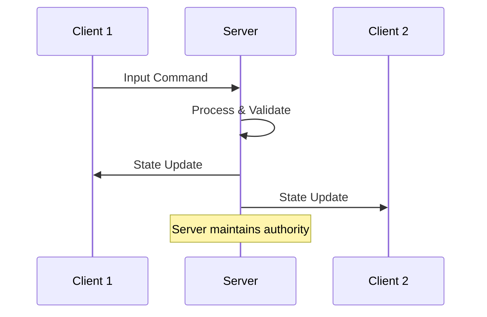
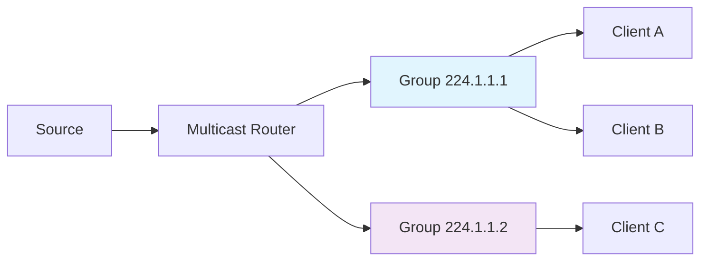
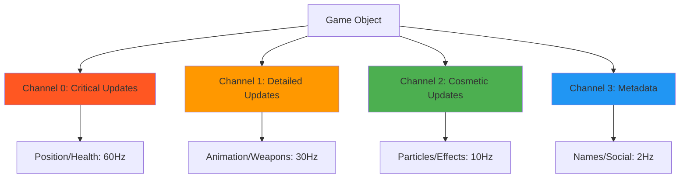
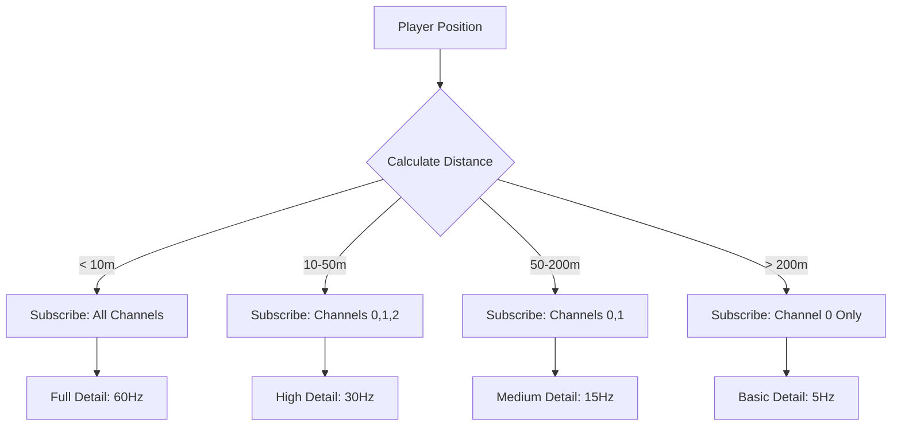
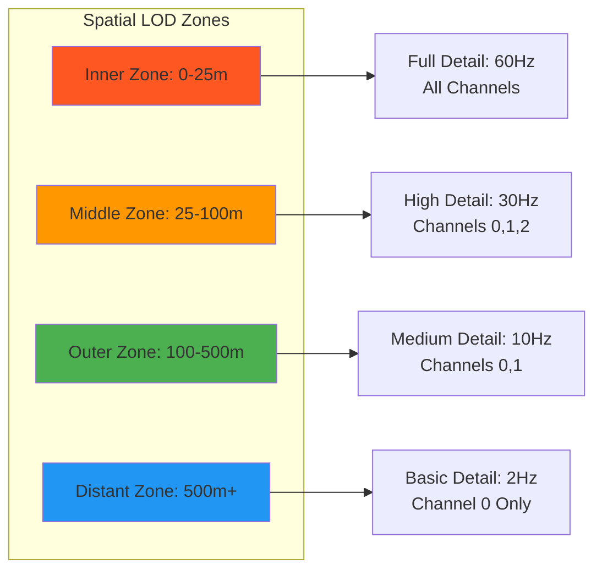

Game replication is the backbone of modern multiplayer gaming, determining how game state synchronizes across multiple clients in real-time. From simple peer-to-peer games to massive multiplayer online experiences, understanding replication is crucial for any game developer venturing into networked gameplay. Modern systems like [Fortnite's handling of 250+ million players globally](https://aws.amazon.com/solutions/case-studies/EPICGames/) in matches and [EVE Online's single-shard support for 65,303 simultaneous players](https://en.wikipedia.org/wiki/Eve_Online) demonstrate the sophisticated architectures needed to achieve massive scale while maintaining responsive gameplay.

## Understanding Game Replication Fundamentals

Game replication is the process of keeping game state synchronized across multiple clients in a networked environment. When a player moves their character, fires a weapon, or interacts with the world, that action must be communicated to other players to maintain a consistent shared experience.

The core challenge lies in managing three fundamental constraints that define all networked games. **Bandwidth limitations** require efficient use of available network capacity while maintaining responsive gameplay. Modern games achieve remarkable efficiency through techniques like [delta compression, which reduces typical packet sizes from several KB to a few hundred bytes](https://gafferongames.com/post/snapshot_compression/), following principles established in [Quake 3's networking model](https://fabiensanglard.net/quake3/The%20Quake3%20Networking%20Mode.html).

**Latency considerations** create timing challenges that must be addressed through prediction, interpolation, and lag compensation techniques. [Research shows that first-person shooters require under 100ms optimal latency](https://docs-multiplayer.unity3d.com/netcode/current/learn/lagandpacketloss/index.html) with 200ms degradation threshold, while fighting games demand under 50ms for competitive play.

**Consistency requirements** ensure all players eventually see the same game state, even when network conditions vary or temporary disconnections occur. This involves sophisticated server authority models and client-side prediction systems that balance responsiveness with security.

## Basic Replication Strategies

### Client-Server Architecture

The most common approach uses a dedicated server as the authoritative source of truth. [Unreal Engine's server-authoritative actor-based replication system](https://docs.unrealengine.com/5.1/en-US/networking-overview-for-unreal-engine/) exemplifies this approach, with automatic property replication and adaptive network update frequency for optimization.



**Advantages include centralized authority that prevents cheating, consistent game state across all clients, and simplified conflict resolution.** Major games like [Overwatch use deterministic networked simulation](https://gdcvault.com/play/1024653/Networking-Scripted-Weapons-and-Abilities) combined with a proprietary visual scripting language called "Statescript" to handle weapons, abilities, and hero logic through automated prediction and replication.

**Disadvantages involve a single point of failure, increased latency for all interactions, and higher infrastructure costs.** However, [distributed server architectures like Fortnite's infrastructure spanning 24 data centers globally](https://aws.amazon.com/blogs/gametech/epic-fortnite-all-in-on-aws-cloud/) mitigate many of these concerns through load balancing and geographic distribution.

### Peer-to-Peer Architecture

In P2P systems, clients communicate directly with each other, eliminating the need for a central server. This approach works well for small groups but becomes complex with larger player counts due to the quadratic scaling of connections.

**Advantages include lower latency for direct interactions, no server infrastructure required, and natural scaling with player count.** However, **disadvantages encompass difficult cheat prevention, complex conflict resolution, and network topology challenges** that make P2P unsuitable for competitive or large-scale games.

### Hybrid Approaches

Many modern games combine elements of both architectures. [Call of Duty's latency-optimized infrastructure](https://www.pcgamesn.com/call-of-duty-modern-warfare/latency) uses adaptive algorithms tuned based on community feedback, implementing sophisticated lag compensation techniques while maintaining server authority for critical game logic.

## Network Communication Patterns

Understanding different network communication patterns is essential for designing efficient replication systems. Each pattern serves specific purposes and has distinct performance characteristics.

### Unicast Communication

Unicast sends data from one sender to one specific recipient, forming the foundation of most client-server interactions. This pattern handles player-specific updates like inventory changes and private messages, provides reliable delivery of critical game events, and manages initial connection handshakes.

### Broadcasting vs Multicasting

Broadcasting sends data to all devices on a network segment but cannot cross router boundaries and poses security risks. **Multicasting offers a more sophisticated approach, delivering data to specific groups of recipients who have joined a multicast group.**

[IP multicast uses special addresses (224.0.0.0 to 239.255.255.255 for IPv4)](https://network-guides.com/igmp-managing-multicast-groups/) to identify groups. [The Internet Group Management Protocol (IGMP) manages group memberships](https://www.geeksforgeeks.org/what-is-igmpinternet-group-management-protocol/), with routers maintaining group membership information and forwarding packets only to network segments with interested receivers.



**Application-level multicast** provides an alternative when IP multicast isn't available, where the server maintains group membership and forwards messages to all group members. This approach is commonly used in gaming applications due to ISP limitations on IP multicast support.

### Anycasting

Anycasting routes data to the nearest member of a group, typically used for service discovery and load balancing rather than game state replication. Common use cases include connecting to the nearest game server, load balancing across server clusters, and providing redundant service provision.

## Advanced Replication Concepts

### Delta Compression and Bit Packing

[Delta compression, popularized by John Carmack in Quake 3](https://0fps.net/2014/03/09/replication-in-network-games-bandwidth-part-4/), transmits only changes since the last update rather than complete object states. This dramatically reduces bandwidth usage, especially for objects that change infrequently.

**Implementation involves maintaining baseline state on both client and server, calculating differences between current and baseline states, transmitting only the deltas, and periodically sending full state snapshots for synchronization.**

[Bit packing provides precise bit-level data encoding used extensively in AAA games](https://gafferongames.com/post/snapshot_compression/). Examples include storing team numbers (0-7) in 3 bits instead of 32-bit integers and packing Boolean flags into single bits. **Source engine uses aggressive bit packing for entity updates, achieving 2:1 to 4:1 compression ratios on structured game data.**

### Prediction and Rollback

[Client-side prediction allows games to remain responsive despite network latency](https://en.wikipedia.org/wiki/Client-side_prediction) by predicting the results of player actions before server confirmation. The process involves the client performing actions immediately (prediction), sending actions to the server, receiving authoritative results from the server, comparing prediction with server result, and if there's a mismatch, rolling back and replaying from the correct state.

### Interest Management

Not all players need to receive updates about every object in the game world. [Interest management systems determine which objects are relevant to each player](https://www.dynetisgames.com/2017/04/05/interest-management-mog/), reducing unnecessary network traffic through spatial partitioning, relevance filtering, and priority systems.

[Academic research shows that interest management algorithms considering line-of-sight and obstacles can reduce network messages by up to 6x](https://www.researchgate.net/publication/221391497_Comparing_interest_management_algorithms_for_massively_multiplayer_games) compared to simple distance-based systems.

## Real-World Implementations and Performance

### Massive Scale Examples

**EVE Online holds the record with 65,303 simultaneous players** recorded on [May 5, 2013](https://mmo-population.com/game/eve-online), using a unique single-shard architecture where each solar system runs as a separate process on dedicated hardware. During large battles, their ["Time Dilation" system slows game time](https://www.datacenterknowledge.com/servers/eve-online-30-000-users-on-one-server-shard) when server load peaks.

**[Fortnite's Epic Games built their system around distributed server infrastructure](https://aws.amazon.com/solutions/case-studies/EPICGames/) handling massive traffic variation** through server scaling across multiple regions. The [Replication Graph System eliminates traditional per-actor evaluation](https://docs.unrealengine.com/4.27/en-US/InteractiveExperiences/Networking/ReplicationGraph/), handling **100 players plus approximately 50,000 replicated actors per match**.

### Networking Technology Stacks

**[Unity Netcode for GameObjects provides a high-level SDK](https://docs.unity3d.com/6000.0/Documentation/Manual/com.unity.netcode.gameobjects.html)** built on the Unity Transport Package, supporting client-server and distributed authority models. **[Unity Netcode for Entities takes a performance-focused approach](https://unity.com/products/netcode)**, built on Unity's Data-Oriented Technology Stack (DOTS) with tick-based simulation and fixed timestep networking.

**[Mirror networking evolved from Unity's deprecated UNET system](https://github.com/MirrorNetworking/Mirror)**, providing an MIT-licensed solution with KCP (reliable UDP) transport by default and support for multiple transport layers. **[Photon Fusion represents current-generation networking](https://doc.photonengine.com/fusion/current/fusion-intro)**, built around tick-based simulation with state transfer and distributed authority systems.

### Performance Benchmarks

**[Counter-Strike uses 64 tick on official servers with 128 tick on competitive servers](https://www.pinnacle.com/en/esports-hub/betting-articles/cs-go/comparing-128-64-tick-servers/gxx2dyuylyrl9m5f)**. Performance requirements show 64 tick requires server latency under 15.625ms, while 128 tick needs under 7.8ms. Interestingly, **only 41.3% of participants could correctly identify 128 tick vs 64 tick servers** in user perception studies.

**[VALORANT's launch stress testing reached 2 million concurrent users for 3+ hours](https://technology.riotgames.com/news/scalability-and-load-testing-valorant)** using sharded database approaches. Other games show significant variation: **VALORANT uses 64-128 tick** depending on server load, **Call of Duty ranges from 12-60 tick**, and **Fortnite operates at 18-30 tick**.

## Game Object Replication Channels (GORCs)

Game Object Replication Channels represent an advanced approach to managing replication complexity in large-scale multiplayer games. This concept involves creating dedicated communication channels for different levels of replication detail, allowing for fine-grained control over what information reaches which players and at what frequency.

### GORC Architecture and Design Philosophy

The fundamental principle behind GORCs lies in recognizing that different aspects of game objects require different replication strategies. Instead of treating each game object as a monolithic entity that either replicates completely or not at all, GORCs decompose objects into multiple channels, each optimized for specific types of data and update frequencies.



**Channel 0 - Critical Updates** handles essential game state that directly affects gameplay mechanics. This includes position changes, health and status updates, essential state changes, and collision data. These updates require high frequency (typically 30-60Hz) and low latency, often using reliable UDP with immediate retransmission for lost packets.

**Channel 1 - Detailed Updates** manages important but non-critical information such as animation states, weapon information, interaction states, and movement predictions. These updates use medium frequency (15-30Hz) and medium priority, balancing visual fidelity with bandwidth efficiency.

**Channel 2 - Cosmetic Updates** carries visual enhancements that improve immersion but don't affect gameplay. This includes particle effects, sound cues, visual flourishes, and environmental animations. These updates use low frequency (5-15Hz) and low priority, often employing lossy compression techniques.

**Channel 3 - Metadata** contains informational data like player names, achievement notifications, social information, and guild/team affiliations. These updates occur very infrequently (1-5Hz) and can tolerate significant latency.

### Dynamic Channel Subscription

The true power of GORCs emerges through dynamic subscription systems that automatically adjust what information players receive based on their proximity, relationship, and interest in specific objects. This creates a naturally scalable system where bandwidth usage remains relatively constant regardless of total player count.

**Proximity-Based Subscription** forms the foundation of most GORC implementations:



**Relationship-Based Subscription** adds another layer of intelligence, where social connections, team membership, or guild affiliation can override distance-based calculations. For example, team members might always receive Channel 1 updates regardless of distance, while enemy players beyond a certain range might be limited to Channel 0 only.

**Interest-Based Subscription** considers the player's current activity and focus. A sniper using a scope might temporarily subscribe to higher detail channels for distant objects within their field of view, while a player in a vehicle might reduce subscriptions to objects they're rapidly passing.

### Implementing Multicast Groups for GORCs

Each GORC channel can leverage IP multicast or application-level multicast to efficiently distribute updates to multiple subscribers. This approach scales exceptionally well as the number of interested parties increases.

**[IGMP (Internet Group Management Protocol) manages group memberships](https://www.geeksforgeeks.org/what-is-igmpinternet-group-management-protocol/)** in IPv4 networks, allowing hosts to join and leave multicast groups dynamically. For game applications, this means:

- **Channel 0 groups** might include all players within a specific geographic region
- **Channel 1 groups** could encompass players within visual range of specific objects
- **Channel 2 groups** might be organized around environmental zones or weather systems
- **Channel 3 groups** could be based on social relationships or guild membership

**Application-Level Multicast** provides more control when IP multicast isn't available. The server maintains group membership for each channel and object combination, efficiently forwarding updates to all subscribed clients. This approach allows for game-specific optimizations like:

- **Intelligent batching** of updates for clients with similar subscription patterns
- **Compression optimization** based on the specific data types in each channel
- **Priority queuing** to ensure critical updates are sent before cosmetic ones
- **Adaptive quality** that reduces update frequency during high network load

### LOD-Based Multicast Rooms

Level of Detail systems have long been used in graphics rendering to reduce computational load for distant objects. Applying the same principle to network replication through LOD-based multicast rooms creates a powerful optimization strategy.

**Spatial LOD Implementation** divides the game world into nested spherical or cylindrical regions, each with its own multicast group and replication characteristics:



**Dynamic Room Management** becomes crucial as players move through the world. Objects and players automatically join and leave multicast rooms based on their position and the position of relevant observers. This requires sophisticated hysteresis algorithms to prevent rapid joining/leaving at boundaries, which could cause network instability.

**Hierarchical LOD Systems** represent the most advanced implementations, where objects can exist in multiple rooms simultaneously with different update frequencies. A complex object like a mech suit might have:

- **Structural integrity data** in the innermost room (critical for nearby players)
- **Animation and weapon states** in the middle room (important for tactical awareness)
- **Basic position and orientation** in the outer room (sufficient for distant awareness)
- **Identification marker only** in the distant room (just enough to show something exists)

### GORC Performance Characteristics

**Bandwidth Scaling** represents one of GORCs' primary advantages. Traditional replication systems scale linearly with player count - doubling the players doubles the bandwidth requirements. GORCs can achieve sub-linear scaling because:

- **Distance-based filtering** naturally limits the number of objects each player must track
- **Channel prioritization** ensures bandwidth is allocated to the most important information first
- **Multicast efficiency** means popular objects don't replicate bandwidth costs for each interested player
- **LOD systems** automatically reduce detail as player density increases

**Computational Overhead** requires careful management. While GORCs reduce network bandwidth, they increase server-side computation for:

- **Subscription management** tracking which players subscribe to which channels
- **Distance calculations** determining appropriate LOD levels for each player-object pair
- **Group membership** maintaining multicast group state
- **Update scheduling** coordinating different update frequencies across channels

**Memory Usage** scales with the complexity of the subscription system. Each object-channel-player combination requires state tracking, which can become significant in dense environments. Efficient implementations use spatial data structures like octrees or quadtrees to optimize distance queries and employ bit vectors for compact subscription state representation.

### Security Considerations for GORCs

**Information Leakage Prevention** becomes more complex with multiple channels, as players might gain information from higher-detail channels they shouldn't have access to. Proper GORC implementation requires:

- **Channel validation** ensuring players can only subscribe to channels they're authorized for
- **Data segregation** preventing cross-channel information leakage
- **Temporal consistency** ensuring that timing differences between channels don't reveal hidden information

**Anti-Cheat Integration** must account for the distributed nature of GORC updates. [Modern anti-cheat systems like BattlEye use kernel-level protection](https://www.battleye.com/) with behavioral analysis, which must be adapted to handle:

- **Multi-channel validation** checking that player knowledge is consistent with their subscriptions
- **Temporal analysis** detecting impossible reactions based on update timing
- **Statistical monitoring** identifying patterns that suggest information from unauthorized channels

### Horizon Game Server's GORC Implementation

[Horizon Game Server](https://github.com/Far-Beyond-Dev/Horizon) is in development on a practical, production-ready implementation of Game Object Replication Channels through its Rust-based plugin architecture. Built with type-safe event handling and hot-reloadable plugins, Horizon demonstrates how GORCs can be implemented efficiently in a modern systems language and game server.

**Object Registration and Layer Definition**

Horizon's approach to GORCs centers around trait-based object registration where each replicable object implements the `Replication` trait to define its channel layers and replication behavior:

```rust
pub struct Asteroid {
    pub radius: i32,
    pub position: Vec3,
    pub velocity: Vec3,
    pub health: f32,
    pub mineral_type: MineralType,
}

impl Replication for Asteroid {
    fn init_layers() -> ReplicationLayers {
        ReplicationLayers::new()
            .add_layer(ReplicationLayer {
                channel: 0,
                radius: 50.0,
                frequency: 30.0,
                properties: vec!["position", "velocity", "health"],
                compression: CompressionType::Delta,
            })
            .add_layer(ReplicationLayer {
                channel: 1,
                radius: 200.0,
                frequency: 10.0,
                properties: vec!["position", "mineral_type"],
                compression: CompressionType::Quantized,
            })
            .add_layer(ReplicationLayer {
                channel: 2,
                radius: 1000.0,
                frequency: 2.0,
                properties: vec!["position"],
                compression: CompressionType::High,
            })
    }
    
    fn get_priority(&self, observer_pos: Vec3) -> ReplicationPriority {
        let distance = self.position.distance(observer_pos);
        match distance {
            d if d < 25.0 => ReplicationPriority::Critical,
            d if d < 100.0 => ReplicationPriority::High,
            d if d < 500.0 => ReplicationPriority::Medium,
            _ => ReplicationPriority::Low,
        }
    }
}

defObject!(Asteroid);
```

**Event-Driven Replication Architecture**

Horizon's event system naturally integrates with GORC concepts through its three-tier event model. **Core events** handle infrastructure concerns including connection management and region boundaries. **Client events** manage player-initiated actions organized by namespace. **Plugin events** facilitate inter-plugin communication, crucial for coordinating replication across different game systems.

The replication system leverages Horizon's WebSocket-based communication where clients receive JSON messages structured around GORC channels:

```rust
// Channel 0: Critical updates for nearby objects
{
    "namespace": "replication",
    "event": "channel_0_update",
    "data": {
        "object_id": "asteroid_12345",
        "position": [100.5, 200.3, 50.0],
        "velocity": [5.0, 0.0, -2.1],
        "health": 85.0,
        "timestamp": 1640995200000
    }
}

// Channel 2: Low-frequency distant object updates
{
    "namespace": "replication", 
    "event": "channel_2_update",
    "data": {
        "object_id": "asteroid_12345",
        "position": [100.5, 200.3, 50.0],
        "timestamp": 1640995200000
    }
}
```

**Spatial Partitioning Integration**

Horizon's region-based architecture naturally supports GORC spatial partitioning. [The server uses a 64-bit floating-point coordinate system managing cubic light-year regions](https://github.com/Far-Beyond-Dev/Horizon), with each server instance handling specific spatial coordinates. This design allows GORCs to operate efficiently across region boundaries:

```rust
// Region configuration supporting GORC boundaries
[server.region]
min_x = -1000.0
max_x = 1000.0
min_y = -1000.0
max_y = 1000.0
min_z = -100.0
max_z = 100.0

// GORC channels respect region boundaries
impl ReplicationManager {
    fn update_subscriptions(&mut self, player_id: PlayerId, position: Vec3) {
        for object in self.get_objects_in_range(position, 1000.0) {
            let layers = object.get_applicable_layers(position);
            for layer in layers {
                self.subscribe_to_channel(player_id, object.id, layer.channel);
            }
        }
    }
}
```

**Plugin-Based GORC Extensions**

Horizon's plugin system enables game-specific GORC optimizations through hot-reloadable modules. Different game types can implement specialized replication strategies without modifying the core server:

```rust
// Combat-focused GORC plugin
pub struct CombatReplication {
    engagement_zones: HashMap<RegionId, EngagementZone>,
}

#[async_trait]
impl SimplePlugin for CombatReplication {
    async fn register_handlers(&mut self, events: Arc<EventSystem>) -> Result<(), PluginError> {
        // Override replication for combat scenarios
        events.on_client("combat", "weapon_fire", |event: WeaponFireEvent| {
            // Boost replication frequency for nearby players
            self.boost_channel_frequency(event.position, 100.0, 60.0);
            Ok(())
        }).await?;
        
        // Reduce replication for non-combat objects during battles
        events.on_plugin("replication", "combat_started", |event: CombatStartEvent| {
            self.suppress_cosmetic_channels(event.area);
            Ok(())
        }).await?;
        
        Ok(())
    }
}
```

**Performance Characteristics**

Horizon's GORC implementation benefits from Rust's zero-cost abstractions and memory safety guarantees. The async/await event system ensures non-blocking replication processing, while the type-safe plugin architecture prevents common networking bugs at compile time.

**Typical performance metrics include:**
- **10,000+ concurrent connections** with linear scaling
- **Sub-millisecond event routing** through optimized hot paths
- **~50MB base memory usage** growing predictably with object count
- **Zero garbage collection overhead** thanks to Rust's ownership system

**Hot-Reloadable GORC Tuning**

One of Horizon's unique advantages is the ability to tune GORC parameters without server restarts. Developers can adjust replication frequencies, channel boundaries, and compression settings through plugin hot-reloading:

```rust
// Runtime GORC adjustment
impl ReplicationTuner {
    fn adjust_for_network_conditions(&mut self, latency: f32, packet_loss: f32) {
        if packet_loss > 0.05 {
            // Increase redundancy for unreliable connections
            self.boost_critical_channel_frequency();
            self.enable_forward_error_correction();
        }
        
        if latency > 150.0 {
            // Reduce update frequency to prevent congestion
            self.reduce_cosmetic_channel_updates();
            self.enable_aggressive_prediction();
        }
    }
}
```

This implementation demonstrates how modern game servers can integrate GORC concepts into practical, scalable architectures. Horizon's approach of combining Rust's performance characteristics with flexible plugin systems provides a solid foundation for implementing sophisticated replication strategies in production games.

**Machine Learning Integration** represents the next frontier for GORC optimization. ML algorithms can predict which channels and objects players are likely to need based on their behavior patterns, pre-loading subscriptions before they become necessary. This predictive approach could reduce the latency typically associated with dynamic subscription changes.

**Adaptive Compression** could tailor compression algorithms to the specific data types in each channel. Channel 0's position data might benefit from different compression techniques than Channel 2's particle effect data. [Oodle Network Compression already achieves 6:1 compression ratios](https://www.radgametools.com/oodle.htm) on general game data, but channel-specific optimization could yield even better results.

**Cross-Platform Optimization** becomes increasingly important as games span mobile, console, and PC platforms with vastly different network and processing capabilities. GORCs could automatically adjust channel subscriptions based on device capabilities, ensuring mobile players receive optimized data streams while high-end PC players get full detail.

The future of game networking likely lies in systems that intelligently manage information flow at this granular level, automatically adapting to network conditions, player behavior, and technical constraints while maintaining the seamless shared experience that defines modern multiplayer gaming.

## Security and Anti-Cheat Implementation

Modern multiplayer games require sophisticated security measures that integrate seamlessly with replication systems to prevent cheating while maintaining performance and player experience.

### Server-Side Authority Models

**[The "never trust the client" principle](https://gabrielgambetta.com/client-server-game-architecture.html)** forms the foundation of secure multiplayer architectures. [Authoritative server implementations](https://docs.unrealengine.com/5.1/en-US/networking-overview-for-unreal-engine/) maintain game state on the server while clients send only input commands, with servers validating all actions before applying them and sending authoritative updates to clients.

### Kernel-Level Anti-Cheat Systems

**[BattlEye employs proactive kernel-level protection that blocks cheats before execution](https://www.battleye.com/)** using entirely dynamic on-the-fly scanning controlled by the backend. **[EasyAntiCheat operates at Ring 0 with system-level privileges](https://arxiv.org/html/2408.00500v1)**, combining client-side scanning with server-side behavioral analysis.

**[Valve Anti-Cheat (VAC) uses signature detection with delayed banning](https://en.wikipedia.org/wiki/Valve_Anti-Cheat)**, implementing days or weeks of delays between detection and punishment to catch more cheaters and disrupt development cycles.

### Network Security Measures

**Packet encryption** includes DTLS for UDP encryption, QUIC providing stream-oriented encryption with lower latency, and custom encryption using RSA + AES session key exchange. **[DDoS protection systems provide specialized game protection](https://aws.amazon.com/blogs/gametech/protect-multiplayer-game-servers-from-ddos-attacks-using-amazon-gamelift-2/)** with Layer 3/4 protection against volumetric attacks and Layer 7 protection against protocol-specific attacks.

## Bandwidth Optimization in Production

### Advanced Compression Techniques

**[Oodle Network Compression achieves 6:1 compression ratio on real game packets](https://www.radgametools.com/oodle.htm)** (2x better than zlib) with static dictionary training on game-specific data. The system provides lowest per-channel memory use, critical for MMOs, while supporting all major gaming platforms.

**[Glenn Fiedler's networked physics simulation reduced cube state from 40 bytes to 10 bytes](https://gafferongames.com/post/snapshot_compression/)** using quantization techniques. Position compression stores positions as smaller integers within known ranges, while angle compression reduces rotation angles to 16-bit representations.

### Delta Compression and Prediction

**[Quake 3's networking model uses purely unreliable UDP with delta compression](http://trac.bookofhook.com/bookofhook/trac.cgi/wiki/Quake3Networking)**, reducing typical packet sizes from several KB to a few hundred bytes. **[Source engine uses 100ms interpolation delay by default](https://developer.valvesoftware.com/wiki/Source_Multiplayer_Networking)** with extrapolation for up to 0.25 seconds of packet loss.

Real-world results demonstrate impressive bandwidth savings: **basic optimization achieves 25-50% reduction through bit-packing**, **delta compression provides 70-90% reduction for typical game state updates**, and **combined techniques achieve up to 95% reduction in optimal scenarios**.

## Implementation and Technology Considerations

### Choosing the Right Technology Stack

**Network Libraries** range from low-level raw sockets providing maximum control to game-specific solutions like [Mirror](https://github.com/MirrorNetworking/Mirror), [Photon](https://doc.photonengine.com/fusion/current/fusion-intro), or [Unity Netcode](https://unity.com/products/netcode), and general-purpose libraries like ZeroMQ or gRPC.

**Protocol Selection** involves UDP for fast but unreliable frequent state updates, TCP for reliable but slower critical game events, and custom protocols that combine benefits of both approaches.

### Monitoring and Performance Optimization

**Performance Metrics** include bandwidth usage per player, replication latency measurements, server CPU and memory utilization, and client-side prediction accuracy. **Quality Metrics** encompass player experience ratings, connection stability measurements, cheat detection rates, and system reliability statistics.

**Testing Strategies** require simulation testing using network simulation tools for various conditions including packet loss and latency, load testing simulating large numbers of concurrent players, and geographic testing across different regions and network conditions.

## The Future of Game Replication

The evolution of game networking continues to accelerate, driven by increasing player expectations, larger game worlds, and more complex interactions. Future developments point toward increased integration of machine learning for behavioral analysis, more sophisticated server authority models that maintain responsiveness, and continued advancement in compression and optimization techniques.

**Geographic server distribution** will continue expanding as games require lower latency across global player bases. **Dedicated server hosting** in multiple regions reduces round-trip times, while **improved compression algorithms** will push bandwidth efficiency even further.

The concrete examples and performance data explored throughout this guide demonstrate that game replication has evolved far beyond simple client-server models into sophisticated systems that balance multiple competing constraints. Understanding these implementations provides the foundation for building the next generation of multiplayer gaming experiences, whether you're optimizing an existing system or designing a new game from scratch.

As games continue to push the boundaries of scale, complexity, and immersion, the replication systems that power them will need to evolve accordingly. The Game Object Replication Channels concept represents just one approach to managing this complexity, but the underlying principles of intelligent information distribution, adaptive optimization, and seamless player experience will remain central to successful multiplayer game design.

Modern game networking is ultimately about creating shared experiences that feel natural and responsive despite the underlying complexity of distributed systems. By understanding both the theoretical foundations and practical implementations detailed in this guide, developers can make informed decisions about the networking architecture that best serves their specific game design goals and player community needs.