# Game Server Orchestration: The Future of Multiplayer Infrastructure

*A comprehensive exploration of modern approaches to multiplayer game server deployment, from MMO orchestration to standalone match-based systems*

## Introduction

The landscape of multiplayer gaming has evolved dramatically over the past two decades. What began with simple dedicated servers hosting a dozen players has transformed into complex orchestrated systems managing thousands of concurrent users across vast, persistent virtual worlds. Game server orchestration—the automated management of server instances, player connections, and resource allocation—has become the backbone of modern multiplayer gaming infrastructure.

Today's players expect seamless experiences: instant matchmaking, persistent worlds that never sleep, and smooth transitions between game areas without loading screens or disconnections. Meeting these expectations requires sophisticated orchestration systems that can dynamically spawn, manage, and coordinate multiple server instances while maintaining state consistency and optimal performance.

This evolution isn't just about scale—it's about fundamentally rethinking how we architect multiplayer experiences. From Horizon Atlas's region-based orchestration to the ephemeral match servers powering battle royales, orchestration systems are enabling new forms of gameplay that were previously impossible.

## The Evolution of Multiplayer Server Deployment

### Early Days: Static Dedicated Servers

In the late 1990s and early 2000s, multiplayer gaming operated on a simple paradigm: dedicated servers ran continuously on fixed hardware, hosting the same map or game mode indefinitely. Players browsed server lists, joined their preferred communities, and formed lasting relationships around specific servers.

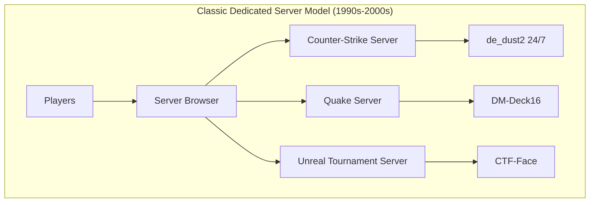

While this model fostered strong communities, it had significant limitations:
- **Resource Waste**: Servers ran 24/7 regardless of player count
- **Geographic Constraints**: Players were limited to nearby servers for acceptable latency
- **Manual Management**: Server operators handled all maintenance, updates, and scaling
- **Limited Persistence**: Player progress was typically confined to individual servers

### The MMO Revolution: Persistent Worlds

Massively Multiplayer Online games introduced the concept of persistent, shared worlds that existed independently of any individual player session. This required entirely new approaches to server architecture:

**Sharding and Instancing**: Games like EverQuest and World of Warcraft pioneered sharding—dividing the game world into multiple parallel instances (servers) to manage player population. Each shard was essentially a complete copy of the game world.

**Zone-Based Architecture**: Early MMOs segmented their worlds into discrete zones, with each zone running on separate server hardware. Players experienced loading screens when transitioning between zones, but this architecture allowed for focused resource allocation and easier maintenance.

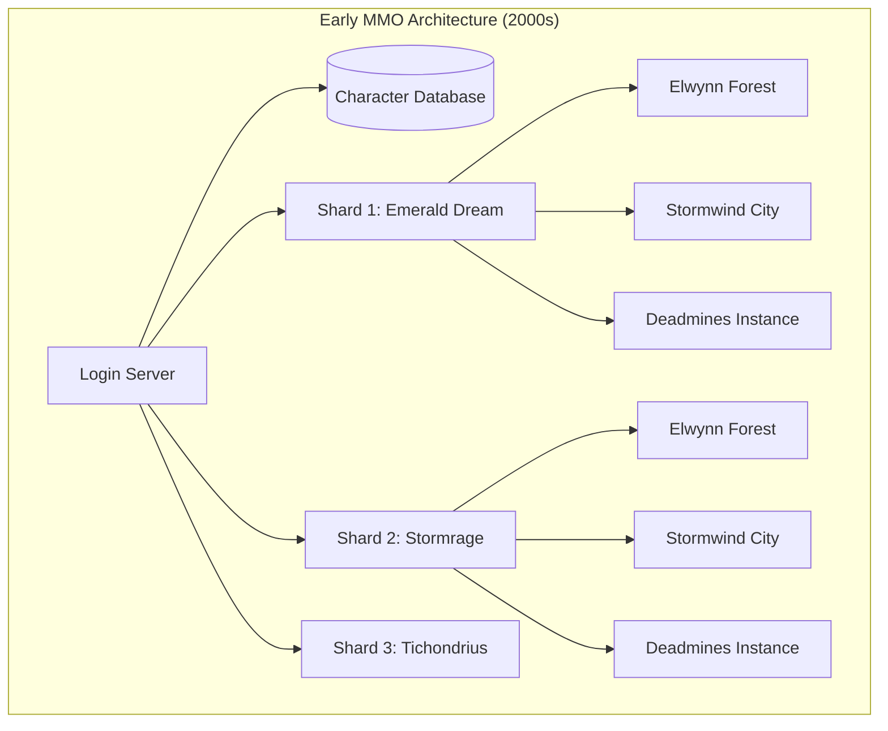

### Modern Era: Dynamic Orchestration

Contemporary multiplayer games demand flexibility that static architectures cannot provide. Modern orchestration systems dynamically create, scale, and destroy server instances based on real-time demand. This shift enables:

- **Elastic Scaling**: Automatically spawn new instances during peak hours
- **Geographic Distribution**: Deploy servers closer to player populations
- **Specialized Hardware**: Use different server configurations for different content types
- **Seamless Updates**: Deploy new versions without global downtime

## Orchestrated Worlds: From Shards to Seamless

Modern MMO-style games have evolved beyond traditional sharding to create truly seamless experiences. Horizon Atlas exemplifies this new generation of orchestration systems that eliminate artificial barriers between game regions.

### Dynamic Region Management

Unlike traditional zone-based systems with hard boundaries, modern orchestrators like Horizon Atlas manage regions as fluid, overlapping areas. The system continuously monitors player movement and preemptively prepares adjacent regions:

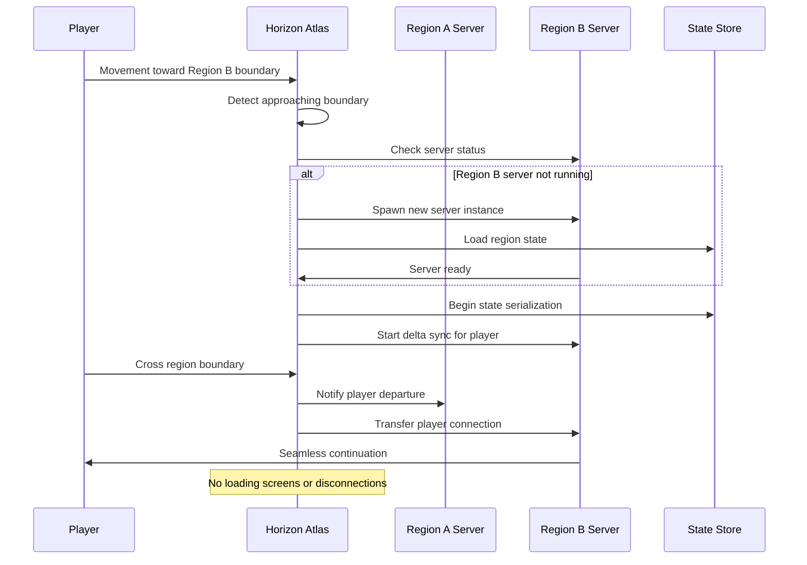

### The Role of Spatial Partitioning

Effective orchestration requires sophisticated spatial awareness. Modern systems use advanced data structures like quadtrees or octrees to efficiently manage spatial queries:

```rust
// Simplified example of spatial partitioning in Horizon
let region_bounds = RegionBounds {
    min_x: -1000.0, max_x: 1000.0,
    min_y: -1000.0, max_y: 1000.0,
    min_z: -100.0, max_z: 100.0,
};

// The orchestrator continuously monitors player positions
events.emit_core("region_started", &RegionStartedEvent {
    region_id: RegionId::new(),
    bounds: region_bounds,
    timestamp: current_timestamp(),
}).await?;
```

This spatial awareness enables the orchestrator to:
- **Predict Movement**: Anticipate which regions players will enter next
- **Load Balance**: Distribute players across available server instances
- **Optimize Resources**: Shut down empty regions while maintaining buffer zones
- **Handle Hotspots**: Spawn additional instances for popular areas

### State Synchronization and Migration

One of the most complex challenges in orchestrated worlds is maintaining consistent player state across region boundaries. Horizon Atlas addresses this through several innovative techniques:

**Delta Compression**: As players approach region boundaries, the system begins compressing and transmitting only the changes (deltas) in player state, rather than the complete state snapshot.

**Predictive Loading**: The orchestrator analyzes player movement patterns to predict likely destinations and preemptively loads relevant data.

**Graceful Handoffs**: Connection handoffs occur seamlessly, with the orchestrator acting as a stateless proxy that maintains encryption/decryption while game servers handle core logic.

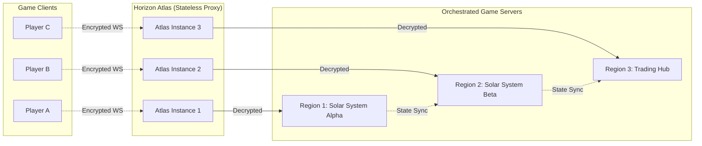

## Standalone Servers: The Power of Ephemerality

While orchestrated persistent worlds grab headlines, ephemeral server models power some of the most popular games today. Battle royales, competitive matches, and casual game modes all benefit from servers that spin up for a specific session and disappear when complete.

### Match-Based Architecture

Modern match-based games like Fortnite, Apex Legends, and Valorant rely on sophisticated orchestration to create and manage ephemeral server instances:

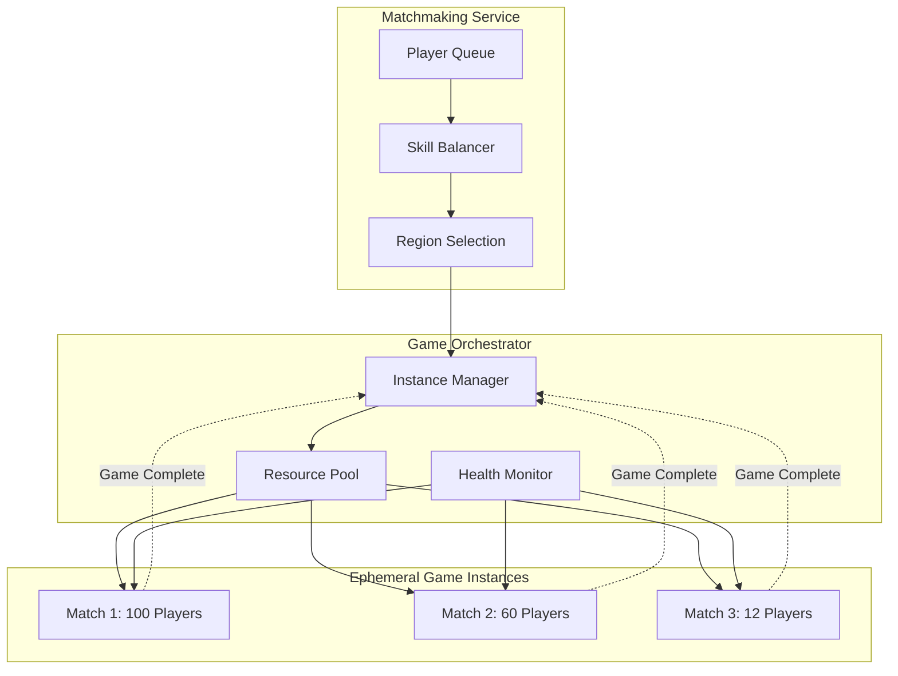

### Scaling Strategies for Ephemeral Servers

Ephemeral servers present unique scaling challenges. Unlike persistent worlds where player count grows gradually, match-based games experience sudden spikes in demand:

**Pre-warming**: Successful orchestrators maintain a pool of ready-to-go server instances to handle immediate demand spikes. This reduces the time between matchmaking and game start.

**Predictive Scaling**: Advanced systems analyze player behavior patterns to predict demand. For example, they might scale up servers before a popular streamer goes live or during expected peak hours.

**Multi-Region Deployment**: Modern orchestrators deploy across multiple cloud regions to minimize latency and provide redundancy.

**Resource Optimization**: Ephemeral servers can use specialized hardware configurations optimized for specific game modes—powerful CPU for physics-heavy scenarios, or high-memory instances for large player counts.

### Container-Native Orchestration

Many modern game servers leverage container technologies like Docker and Kubernetes for orchestration. This approach provides several advantages:

```yaml
apiVersion: apps/v1
kind: Deployment
metadata:
  name: game-server-pool
spec:
  replicas: 10
  template:
    spec:
      containers:
      - name: horizon-game-server
        image: horizon/game-server:latest
        ports:
        - containerPort: 8080
        env:
        - name: REGION_BOUNDS
          value: "-1000,1000,-1000,1000,-100,100"
        - name: MAX_PLAYERS
          value: "100"
        resources:
          requests:
            memory: "1Gi"
            cpu: "500m"
          limits:
            memory: "2Gi"
            cpu: "1000m"
```

**Benefits of Container Orchestration**:
- **Consistent Deployment**: Identical environments across development, testing, and production
- **Resource Isolation**: Containers prevent game servers from interfering with each other
- **Rapid Scaling**: New instances can spin up in seconds rather than minutes
- **Health Management**: Automatic restart of failed instances
- **Rolling Updates**: Deploy new game versions without downtime

## Industry Case Studies: How the Giants Do It

### EVE Online: The Ultimate Persistent Universe

EVE Online represents one of the most ambitious persistent world implementations. CCP Games operates the entire game universe on a single shard (Tranquility) supporting over 500,000 active players in a single, persistent universe.

**Key Innovations**:
- **Time Dilation**: When server load becomes excessive, the game slows down time rather than degrading quality
- **Reinforced Nodes**: Critical battles can be moved to more powerful hardware
- **Economic Simulation**: The entire game economy runs on dedicated economic servers
- **Single Shard Philosophy**: All players exist in the same universe, creating meaningful scarcity and politics

### World of Warcraft: Layering and Connected Realms

Blizzard's approach to WoW has evolved significantly since its 2004 launch. Modern WoW uses several sophisticated techniques:

**Dynamic Layering**: During high-population periods, the game creates temporary "layers" of the same zone to reduce overcrowding while maintaining the social aspects of shared spaces.

**Connected Realms**: Low-population servers are virtually merged, allowing players to interact across traditional server boundaries while maintaining separate economies.

**Cross-Realm Zones**: Outdoor zones automatically balance player populations by phasing players from different realms together.

### Fortnite: Global Orchestration at Scale

Epic Games' Fortnite demonstrates orchestration at unprecedented scale, supporting over 350 million registered users with concurrent matches across multiple game modes:

**Hybrid Cloud Architecture**: Combines on-premises infrastructure with cloud resources for optimal cost and performance.

**Geographic Distribution**: Servers deployed across multiple continents with sophisticated latency-based matchmaking.

**Modular Game Modes**: Different game modes (Battle Royale, Creative, Save the World) use specialized server configurations.

**Content Delivery**: Static content (maps, assets) delivered via CDN while dynamic game state uses dedicated game servers.

### Destiny 2: Hybrid Peer-to-Peer and Dedicated Servers

Bungie's Destiny 2 uses a unique hybrid approach that combines peer-to-peer networking with dedicated servers:

**Activity-Based Allocation**: Different content types use different networking models:
- **PvE Activities**: Peer-to-peer with host migration
- **Competitive PvP**: Dedicated servers for authoritative hit detection
- **Social Spaces**: Dedicated servers for persistence

**Dynamic Switching**: The game seamlessly transitions between networking models based on activity type.

### Roblox: User-Generated Content Orchestration

Roblox faces a unique challenge: orchestrating millions of user-created experiences, each with different requirements:

**Experience-Based Instances**: Each Roblox experience (game) runs on separate server instances with automatic scaling.

**Cross-Experience Communication**: Players can move between experiences while maintaining social connections.

**Resource Limits**: Automatic resource allocation based on experience popularity and complexity.

**Developer Tools**: Comprehensive orchestration APIs allow developers to manage their own server instances.

### Minecraft: Community-Driven Orchestration

Minecraft's approach emphasizes community hosting while providing official orchestration for Realms:

**Minecraft Realms**: Official hosting service that provides orchestrated servers for casual players.

**Community Servers**: Massive networks like Hypixel run their own orchestration systems managing hundreds of mini-game instances.

**Modded Server Ecosystems**: Complex modded servers use custom orchestration to manage different game modes and player progression.

## The Role of the Orchestrator: Proxy, Coordinator, Listener

Modern game orchestrators like Horizon Atlas serve multiple critical functions beyond simple server management. They act as intelligent intermediaries that enhance security, performance, and user experience.

### The "Man in the Middle" Model

Contemporary orchestrators often implement a "man in the middle" architecture where the orchestrator sits between clients and game servers, providing several key benefits:

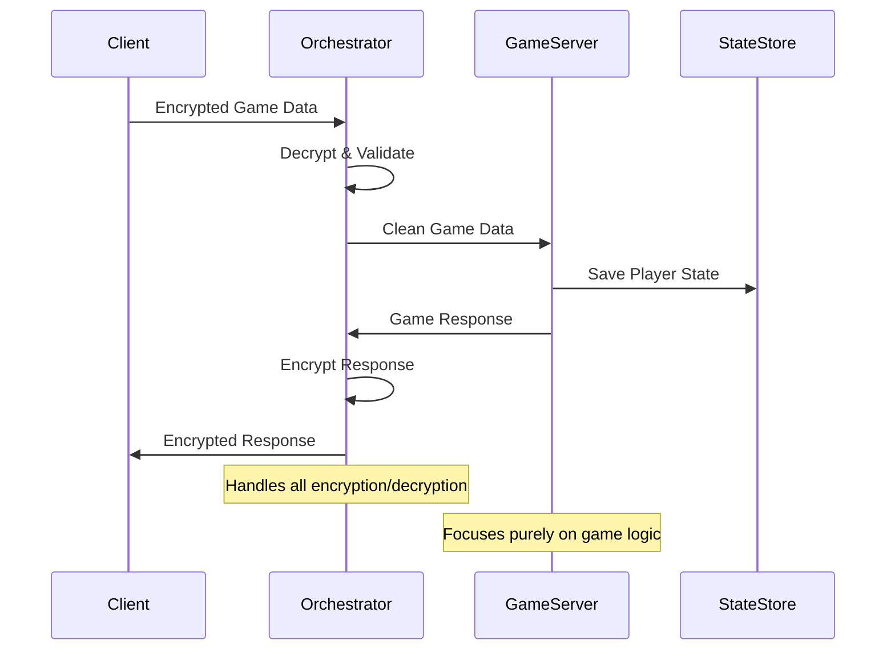

**Security Benefits**:
- **DDoS Protection**: Orchestrators can absorb and filter malicious traffic before it reaches game servers
- **Encryption Termination**: Centralizing encryption/decryption reduces load on game servers
- **Authentication**: Single point for validating player credentials and permissions
- **Rate Limiting**: Prevent clients from overwhelming game servers with requests

**Performance Benefits**:
- **Connection Pooling**: Maintain persistent connections to game servers while handling transient client connections
- **Compression**: Apply game-specific compression algorithms optimized for different data types
- **Caching**: Cache frequently requested data to reduce game server load
- **Load Balancing**: Intelligently route requests to the least loaded available servers

### Event Listening and State Coordination

Sophisticated orchestrators continuously monitor game events to make intelligent decisions about resource allocation and player management:

```rust
// Example from Horizon's event system
events.on_core("player_connected", |event: PlayerConnectedEvent| {
    info!("Player {} connected from {}", event.player_id, event.remote_addr);
    // Orchestrator can use this to track regional player populations
    Ok(())
}).await?;

events.on_client("movement", "position_update", |event: RawClientMessageEvent| {
    // Monitor player movement to predict region transitions
    handle_player_movement(event.player_id, &event.data)?;
    Ok(())
}).await?;
```

**Movement Prediction**: By listening to player movement events, orchestrators can predict when players will cross region boundaries and prepare accordingly.

**Population Monitoring**: Real-time tracking of player distributions helps optimize server allocation and identify popular areas that might need additional resources.

**Behavioral Analysis**: Understanding player patterns helps predict demand spikes and optimize pre-warming strategies.

### State Serialization and Migration

One of the most complex aspects of orchestration is managing player state during server transitions. Modern systems use several sophisticated techniques:

**Incremental State Transfer**: Rather than transferring complete player state, orchestrators track and transfer only the changes since the last synchronization point.

**Predictive Caching**: Based on movement patterns, orchestrators can pre-cache relevant state data in target regions before players arrive.

**Rollback Mechanisms**: If state transfer fails, systems can gracefully roll back to the last known good state.

```rust
// Simplified example of state migration in Horizon
pub async fn migrate_player_state(
    player_id: PlayerId,
    source_region: RegionId,
    target_region: RegionId,
    orchestrator: &Atlas
) -> Result<(), MigrationError> {
    // Begin state serialization while player is still in source region
    let player_state = orchestrator.serialize_player_state(player_id).await?;
    
    // Apply delta compression for efficient transfer
    let compressed_state = compress_state_delta(&player_state)?;
    
    // Pre-sync to target region
    orchestrator.pre_sync_player(target_region, player_id, compressed_state).await?;
    
    // Perform the actual handoff
    orchestrator.transfer_connection(player_id, source_region, target_region).await?;
    
    Ok(())
}
```

### Encryption and Security in the Proxy Model

The proxy model enables sophisticated security measures that would be impractical to implement in individual game servers:

**End-to-End Encryption**: Orchestrators handle all cryptographic operations, using modern protocols like TLS 1.3 with forward secrecy.

**Certificate Management**: Centralized certificate management simplifies deployment and ensures consistent security policies.

**Protocol Translation**: Orchestrators can translate between different protocols—accepting WebSocket connections from clients while using more efficient binary protocols for server communication.

**Audit Logging**: All player actions can be logged at the orchestrator level for security auditing and fraud detection.

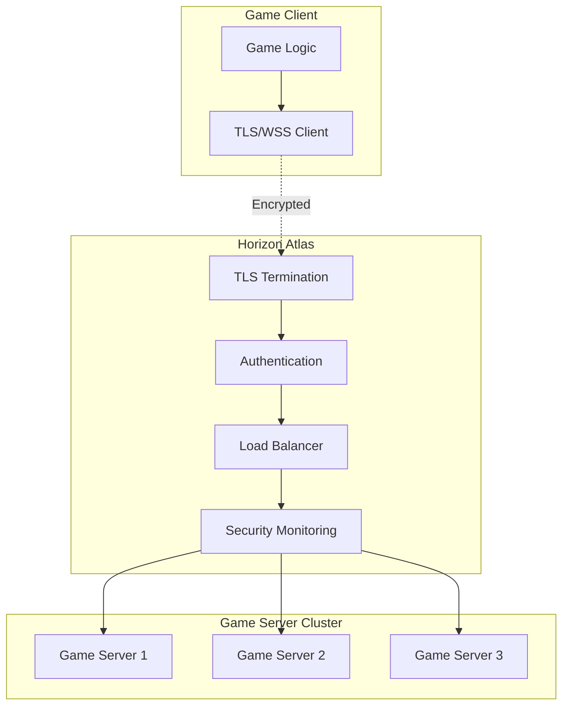

## Deep Dive: Event Listening, State Sync, and the "Man-in-the-Middle"

The orchestrator's ability to monitor and react to game events in real-time is what distinguishes modern systems from simple server management tools. This section explores the technical implementation of event-driven orchestration.

### Event-Driven Architecture

Modern orchestrators like Horizon Atlas use sophisticated event systems to monitor game state and make intelligent decisions:

```rust
// Event system registration in Horizon
#[async_trait]
impl SimplePlugin for OrchestrationPlugin {
    async fn register_handlers(&mut self, events: Arc<EventSystem>) -> Result<(), PluginError> {
        // Monitor player movement for region prediction
        events.on_client("movement", "position_update", |event: RawClientMessageEvent| {
            self.analyze_player_movement(event.player_id, &event.data)?;
            Ok(())
        }).await?;
        
        // Track region populations
        events.on_core("player_connected", |event: PlayerConnectedEvent| {
            self.update_region_population(event.player_id, 1)?;
            Ok(())
        }).await?;
        
        // Handle region transitions
        events.on_plugin("orchestrator", "region_transition", |event: RegionTransitionEvent| {
            self.prepare_target_region(event.target_region)?;
            Ok(())
        }).await?;
        
        Ok(())
    }
}
```

**Multi-Layered Event Processing**: Orchestrators process events at multiple levels:
- **Core Events**: Server lifecycle, connection management
- **Client Events**: Player actions, movement, interactions  
- **Plugin Events**: Inter-system communication
- **GORC Events**: Object replication and state changes

### Advanced State Synchronization

The Game Object Replication Channels (GORC) system in Horizon demonstrates sophisticated approaches to state management:

```rust
// GORC replication with multiple channels
pub struct GorcSystem {
    // Channel 0: Critical data (position, health) - 30-60Hz
    critical_channel: ReplicationChannel,
    // Channel 1: Detailed data (velocity, rotation) - 15-30Hz  
    detailed_channel: ReplicationChannel,
    // Channel 2: Cosmetic data (animations, effects) - 5-15Hz
    cosmetic_channel: ReplicationChannel,
    // Channel 3: Metadata (inventory, stats) - 1-5Hz
    metadata_channel: ReplicationChannel,
}

impl GorcSystem {
    pub async fn replicate_object_state(
        &self,
        object_id: ObjectId,
        observers: &[PlayerId]
    ) -> Result<(), ReplicationError> {
        // Different data types use different channels and frequencies
        for channel in 0..4 {
            let subscribers = self.get_channel_subscribers(object_id, channel).await;
            if !subscribers.is_empty() {
                let data = self.serialize_channel_data(object_id, channel).await?;
                self.broadcast_to_subscribers(channel, &data, &subscribers).await?;
            }
        }
        Ok(())
    }
}
```

**Channel-Based Replication**: Different types of data are replicated at different frequencies:
- **Critical Channel**: Position, health, immediate combat data
- **Detailed Channel**: Velocity, rotation, secondary attributes
- **Cosmetic Channel**: Visual effects, animations, non-critical updates
- **Metadata Channel**: Inventory, long-term stats, configuration

**Proximity-Based Subscriptions**: Players automatically subscribe to objects within certain distances, with different channel ranges:

```rust
// Example proximity configuration
let proximity_config = ProximityConfig {
    critical_range: 50.0,   // High-frequency updates for nearby objects
    detailed_range: 150.0,  // Medium-frequency for moderate distance
    cosmetic_range: 300.0,  // Low-frequency for distant but visible objects
    metadata_range: 1000.0, // Very low frequency for distant objects
};
```

### Real-Time Decision Making

Orchestrators must make split-second decisions about resource allocation based on incoming event data:

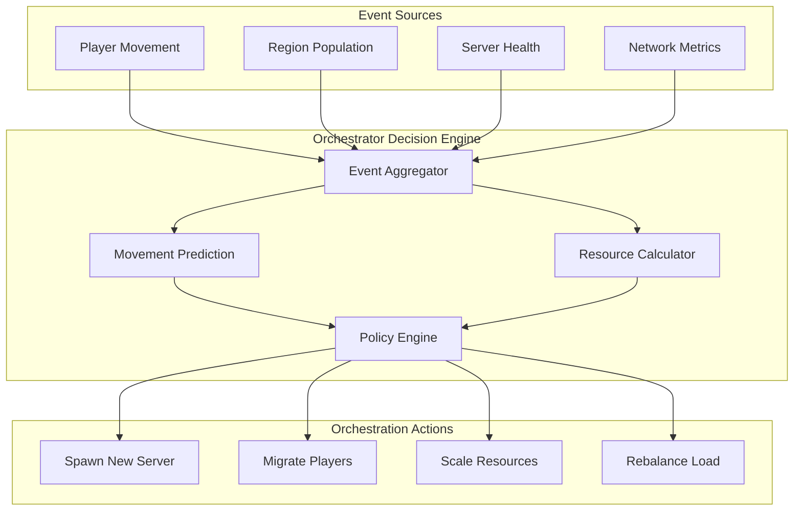

**Predictive Analysis**: Machine learning models analyze movement patterns to predict where players will go next.

**Resource Optimization**: Real-time analysis of server performance metrics determines optimal resource allocation.

**Policy-Based Decisions**: Configurable rules determine when to scale up, scale down, or migrate players between servers.

### Implementation: Horizon's Orchestration Pipeline

Horizon Atlas implements a sophisticated pipeline for managing the complete orchestration lifecycle:

```rust
pub struct AtlasOrchestrator {
    event_system: Arc<EventSystem>,
    region_manager: Arc<RegionManager>,
    player_tracker: Arc<PlayerTracker>,
    server_pool: Arc<ServerPool>,
    state_store: Arc<StateStore>,
}

impl AtlasOrchestrator {
    pub async fn handle_player_movement(
        &self,
        player_id: PlayerId,
        new_position: Vec3
    ) -> Result<(), OrchestrationError> {
        // Track the player's new position
        self.player_tracker.update_position(player_id, new_position).await?;
        
        // Check if player is approaching a region boundary
        if let Some(target_region) = self.region_manager
            .check_approaching_boundary(player_id, new_position).await? {
            
            // Ensure target region server is ready
            self.prepare_region_server(target_region).await?;
            
            // Begin state pre-synchronization
            self.begin_state_presync(player_id, target_region).await?;
            
            // If player crosses boundary, perform handoff
            if self.region_manager.crossed_boundary(player_id, new_position).await? {
                self.execute_region_handoff(player_id, target_region).await?;
            }
        }
        
        Ok(())
    }
    
    async fn prepare_region_server(&self, region_id: RegionId) -> Result<(), OrchestrationError> {
        // Check if server already exists and is healthy
        if let Some(server) = self.server_pool.get_server(region_id).await {
            if server.is_healthy() {
                return Ok(());
            }
        }
        
        // Spawn new server instance
        let server_config = self.region_manager.get_server_config(region_id).await?;
        let new_server = self.server_pool.spawn_server(server_config).await?;
        
        // Load region state from persistent storage
        let region_state = self.state_store.load_region_state(region_id).await?;
        new_server.initialize_state(region_state).await?;
        
        // Register server as ready
        self.server_pool.register_server(region_id, new_server).await?;
        
        Ok(())
    }
}
```

This pipeline demonstrates the key principles of modern orchestration:
1. **Reactive Monitoring**: Continuously track player positions and server health
2. **Predictive Preparation**: Anticipate needs before they become critical
3. **Graceful Handoffs**: Minimize disruption during transitions
4. **State Consistency**: Maintain data integrity across all operations

## Scaling and Elasticity: When to Spin Up, When to Spin Down

Effective orchestration requires sophisticated decision-making about when to allocate and deallocate resources. These decisions directly impact both cost efficiency and player experience.

### Predictive Scaling Algorithms

Modern orchestrators use multiple data sources to predict demand:

```rust
pub struct ScalingPredictor {
    historical_data: HistoricalMetrics,
    player_behavior: BehaviorAnalyzer,
    external_events: EventCalendar,
}

impl ScalingPredictor {
    pub async fn predict_demand(
        &self,
        region: RegionId,
        time_horizon: Duration
    ) -> Result<DemandPrediction, PredictionError> {
        let historical_pattern = self.historical_data
            .get_pattern(region, time_horizon).await?;
        
        let behavioral_trends = self.player_behavior
            .analyze_movement_trends(region).await?;
        
        let scheduled_events = self.external_events
            .get_upcoming_events(time_horizon).await?;
        
        // Machine learning model combines these inputs
        let prediction = self.ml_model.predict(
            historical_pattern,
            behavioral_trends,
            scheduled_events
        ).await?;
        
        Ok(prediction)
    }
}
```

**Data Sources for Prediction**:
- **Historical Patterns**: Time-of-day, day-of-week, seasonal trends
- **Player Behavior**: Movement patterns, activity preferences, social clustering
- **External Events**: Game updates, marketing campaigns, community events
- **Real-Time Metrics**: Current player count, server load, network latency

### Elasticity Strategies

Different types of game content require different scaling approaches:

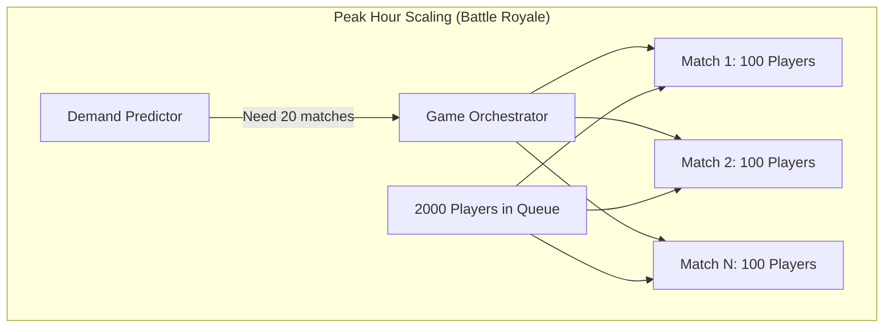

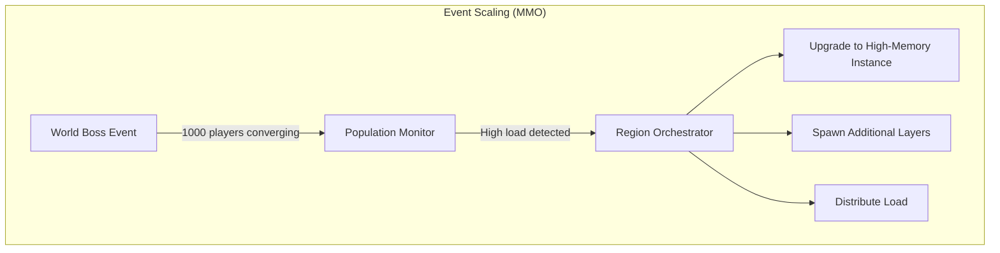

### Cost Optimization

Orchestrators must balance performance with cost efficiency:

**Instance Right-Sizing**: Different content types require different hardware configurations:
```rust
pub struct InstanceConfig {
    cpu_cores: u32,
    memory_gb: u32,
    network_bandwidth: Bandwidth,
    storage_type: StorageType,
}

// Examples of specialized configurations
let battle_royale_config = InstanceConfig {
    cpu_cores: 8,        // High CPU for physics simulation
    memory_gb: 16,       // Moderate memory for 100 players
    network_bandwidth: Bandwidth::High,
    storage_type: StorageType::SSD,
};

let mmo_region_config = InstanceConfig {
    cpu_cores: 4,        // Lower CPU requirements
    memory_gb: 32,       // High memory for persistent state
    network_bandwidth: Bandwidth::Medium,
    storage_type: StorageType::NetworkSSD,
};

let creative_mode_config = InstanceConfig {
    cpu_cores: 16,       // Very high CPU for user-generated content
    memory_gb: 64,       // Large memory for complex builds
    network_bandwidth: Bandwidth::VeryHigh,
    storage_type: StorageType::NVMe,
};
```

**Geographic Distribution**: Place servers closer to player populations:

```rust
pub struct GeographicOptimizer {
    player_locations: PlayerGeoData,
    datacenter_costs: DatacenterPricing,
    network_topology: NetworkMap,
}

impl GeographicOptimizer {
    pub async fn optimize_placement(
        &self,
        expected_players: PlayerDistribution
    ) -> Result<PlacementPlan, OptimizationError> {
        let mut placements = Vec::new();
        
        for region in expected_players.regions() {
            let player_density = expected_players.get_density(region);
            let cost_analysis = self.analyze_costs(region, player_density).await?;
            let latency_requirements = self.calculate_latency_needs(region).await?;
            
            let optimal_datacenters = self.select_datacenters(
                cost_analysis,
                latency_requirements,
                player_density
            ).await?;
            
            placements.push(RegionPlacement {
                region,
                datacenters: optimal_datacenters,
                instance_count: self.calculate_instance_count(player_density),
            });
        }
        
        Ok(PlacementPlan { placements })
    }
}
```

### Advanced Scaling Patterns

**Gradual Scale-Down with Buffer Zones**: Avoid aggressive scale-down that could cause service disruption:

```rust
pub struct GradualScaler {
    scale_down_delay: Duration,
    minimum_buffer: usize,
    utilization_threshold: f32,
}

impl GradualScaler {
    pub async fn evaluate_scale_down(
        &self,
        region: RegionId,
        current_instances: &[ServerId]
    ) -> Result<ScaleDecision, ScalingError> {
        let utilization = self.measure_utilization(current_instances).await?;
        
        if utilization < self.utilization_threshold {
            // Wait for sustained low utilization before scaling down
            let low_utilization_duration = self.measure_low_utilization_duration(region).await?;
            
            if low_utilization_duration > self.scale_down_delay {
                let target_count = self.calculate_target_instances(utilization)?;
                let buffer_count = (target_count as f32 * 1.2) as usize; // 20% buffer
                let final_count = buffer_count.max(self.minimum_buffer);
                
                if final_count < current_instances.len() {
                    return Ok(ScaleDecision::ScaleDown {
                        target_instances: final_count,
                        instances_to_remove: current_instances.len() - final_count,
                    });
                }
            }
        }
        
        Ok(ScaleDecision::NoAction)
    }
}
```

**Predictive Pre-warming**: Start warming up resources before demand hits:

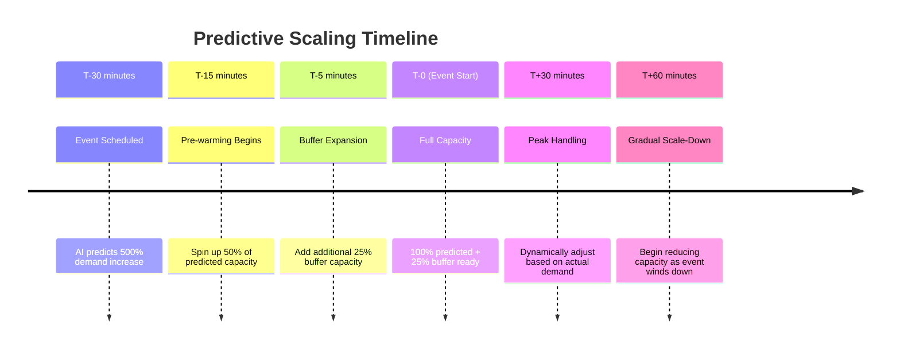

### Resource Lifecycle Management

Effective orchestration manages the complete lifecycle of server resources:

```rust
pub struct ResourceLifecycle {
    spawn_time: Duration,
    warmup_time: Duration,
    max_lifetime: Duration,
    cooldown_period: Duration,
}

impl ResourceLifecycle {
    pub async fn manage_instance_lifecycle(
        &self,
        instance: &GameServerInstance
    ) -> Result<LifecycleAction, LifecycleError> {
        let instance_age = instance.age();
        let current_load = instance.current_load().await?;
        let health_status = instance.health_check().await?;
        
        match (instance_age, current_load, health_status) {
            // New instance still warming up
            (age, _, _) if age < self.warmup_time => {
                Ok(LifecycleAction::Warming)
            }
            
            // Healthy instance within lifetime limits
            (age, load, HealthStatus::Healthy) if age < self.max_lifetime => {
                if load > 0.8 {
                    Ok(LifecycleAction::ScaleUp)
                } else if load < 0.2 {
                    Ok(LifecycleAction::ConsiderScaleDown)
                } else {
                    Ok(LifecycleAction::Maintain)
                }
            }
            
            // Instance approaching maximum lifetime
            (age, load, HealthStatus::Healthy) if age > self.max_lifetime * 0.9 => {
                Ok(LifecycleAction::PrepareReplacement)
            }
            
            // Unhealthy instance
            (_, _, HealthStatus::Unhealthy) => {
                Ok(LifecycleAction::ImmediateReplace)
            }
            
            // Instance exceeded maximum lifetime
            (age, _, _) if age > self.max_lifetime => {
                Ok(LifecycleAction::ForceRetirement)
            }
            
            _ => Ok(LifecycleAction::Monitor)
        }
    }
}
```

## Community Hosting & Modding: Democratizing Server Infrastructure

One of the most powerful aspects of modern orchestration systems is their ability to empower communities and indie developers. Standalone server models, in particular, have become essential for fostering vibrant modding communities and enabling grassroots game development.

### The Community Server Renaissance

The rise of container-based orchestration has democratized game server hosting, allowing communities to run sophisticated multiplayer experiences with minimal infrastructure knowledge:

```yaml
# docker-compose.yml for community server
version: '3.8'
services:
  horizon-game-server:
    image: horizon/community-edition:latest
    ports:
      - "8080:8080"
    environment:
      - REGION_BOUNDS=-1000,1000,-1000,1000,-100,100
      - MAX_PLAYERS=50
      - PLUGIN_DIRECTORY=/plugins
    volumes:
      - ./plugins:/app/plugins
      - ./config:/app/config
      - ./saves:/app/saves
    restart: unless-stopped
    
  redis:
    image: redis:alpine
    volumes:
      - redis_data:/data
      
volumes:
  redis_data:
```

**Benefits for Communities**:
- **Low Barrier to Entry**: Docker containers eliminate complex setup procedures
- **Consistent Environments**: Identical server setup across different hosting providers
- **Easy Scaling**: Simple commands to scale up for events or scale down for cost savings
- **Plugin Ecosystem**: Standardized plugin architecture enables rich customization

### Modding-Friendly Architecture

Modern orchestration systems like Horizon are designed from the ground up to support extensive modding:

```rust
// Example of a community-created plugin
pub struct CommunityEventPlugin {
    event_schedule: EventSchedule,
    player_rewards: RewardSystem,
    custom_mechanics: Vec<Box<dyn GameMechanic>>,
}

#[async_trait]
impl SimplePlugin for CommunityEventPlugin {
    fn name(&self) -> &str { "community_events" }
    fn version(&self) -> &str { "1.0.0" }
    
    async fn register_handlers(&mut self, events: Arc<EventSystem>) -> Result<(), PluginError> {
        // Register for player events
        events.on_client("events", "join_event", |event: RawClientMessageEvent| {
            self.handle_event_join(event.player_id, &event.data)?;
            Ok(())
        }).await?;
        
        // Register for custom game mechanics
        events.on_plugin("events", "custom_mechanic", |event: CustomMechanicEvent| {
            self.process_custom_mechanic(event)?;
            Ok(())
        }).await?;
        
        // Register periodic event scheduling
        events.on_core("server_tick", |event: ServerTickEvent| {
            self.update_scheduled_events(event.timestamp)?;
            Ok(())
        }).await?;
        
        Ok(())
    }
}

create_simple_plugin!(CommunityEventPlugin);
```

**Plugin System Benefits**:
- **Memory Safety**: Rust's ownership system prevents plugins from crashing the server
- **Hot Reloading**: Update plugins without restarting the server
- **Type Safety**: Compile-time guarantees prevent common plugin errors
- **Sandboxing**: Plugins can't access unauthorized server resources

### Decentralized Orchestration Networks

Some communities have built decentralized networks of game servers that coordinate with each other:

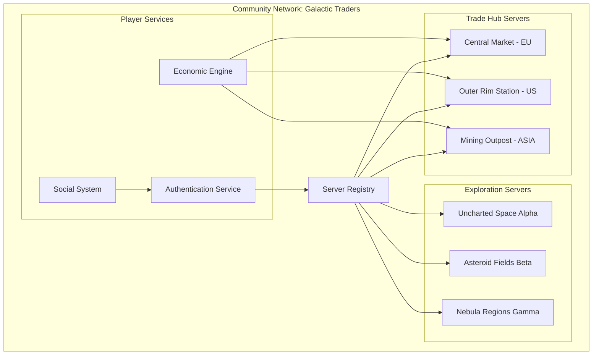

**Decentralized Features**:
- **Cross-Server Economy**: Players can trade across different server instances
- **Persistent Identity**: Player progress carries across community servers
- **Federated Authentication**: Single login across the entire network
- **Load Distribution**: Players automatically distributed across available servers

### Supporting Indie Developers

Orchestration-as-a-Service platforms are emerging to help indie developers focus on game design rather than infrastructure:

```rust
// Simplified API for indie developers
pub struct IndieOrchestrator {
    client: OrchestrationClient,
    game_config: GameConfiguration,
}

impl IndieOrchestrator {
    pub async fn deploy_game_mode(
        &self,
        mode: GameMode,
        expected_players: u32
    ) -> Result<DeploymentInfo, DeploymentError> {
        let deployment_request = DeploymentRequest {
            game_mode: mode,
            player_capacity: expected_players,
            geographic_regions: self.select_optimal_regions(expected_players).await?,
            instance_config: self.calculate_instance_requirements(mode).await?,
            auto_scaling: AutoScalingConfig {
                min_instances: 1,
                max_instances: expected_players / 50, // 50 players per instance
                scale_up_threshold: 0.8,
                scale_down_threshold: 0.3,
            },
        };
        
        let deployment = self.client.deploy(deployment_request).await?;
        
        Ok(DeploymentInfo {
            endpoints: deployment.endpoints,
            monitoring_dashboard: deployment.dashboard_url,
            estimated_cost: deployment.cost_estimate,
        })
    }
}
```

**Indie-Focused Features**:
- **Pay-Per-Use**: Only pay for actual server usage, not reserved capacity
- **Automatic Scaling**: Handle viral growth without manual intervention
- **Global Distribution**: Deploy worldwide without managing multiple cloud accounts
- **Integrated Analytics**: Built-in player behavior and performance analytics

### Case Study: Minecraft Server Networks

Minecraft server networks demonstrate the power of community-driven orchestration at scale:

**Hypixel Network Architecture**:
- **Lobby System**: Players connect to lobby servers that route them to game instances
- **Game Instance Pools**: Separate server pools for different game modes
- **Dynamic Allocation**: Game servers spin up and down based on demand
- **Cross-Server Communication**: Persistent player data and friend systems

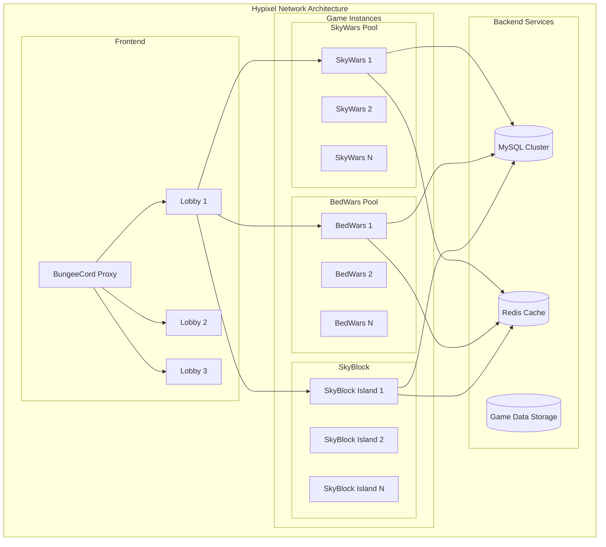

**Key Innovations in Community Networks**:
- **Queue Management**: Sophisticated queuing systems handle peak demand
- **Cross-Server Parties**: Players can stay together across different game modes
- **Dynamic Resource Allocation**: Automatically adjust server counts based on game mode popularity
- **Custom Plugin Ecosystems**: Extensive APIs for community developers

## Future Horizons: Edge, Serverless, and Beyond

The future of game server orchestration is being shaped by emerging technologies that promise to further reduce latency, improve scalability, and enhance player experiences.

### Edge Computing Revolution

Edge computing brings game servers physically closer to players, reducing latency to unprecedented levels:

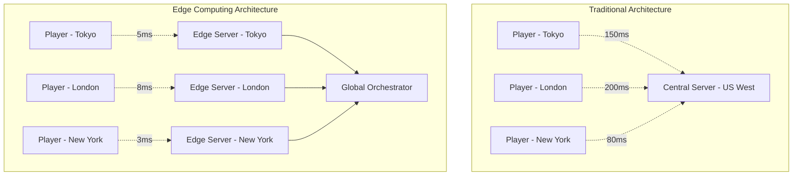

**Edge Computing Benefits**:
- **Ultra-Low Latency**: Sub-10ms response times become achievable
- **Improved Responsiveness**: Better experience for competitive and VR games
- **Reduced Bandwidth Costs**: Less data needs to travel long distances
- **Resilience**: Localized failures don't affect global service

**Implementation Challenges**:
- **State Synchronization**: Maintaining consistency across distributed edge nodes
- **Resource Constraints**: Edge nodes have limited compute and storage capacity
- **Complex Orchestration**: Managing hundreds of edge locations requires sophisticated automation

### Serverless Game Servers

Serverless computing promises to revolutionize how we think about game server deployment:

```rust
// Example serverless game function
use lambda_runtime::{service_fn, Error, LambdaEvent};
use serde_json::{json, Value};

pub async fn game_tick_handler(
    event: LambdaEvent<GameTickEvent>
) -> Result<Value, Error> {
    let game_state = load_game_state(&event.payload.game_id).await?;
    
    // Process one game tick
    let updated_state = process_game_logic(&game_state, &event.payload.player_actions)?;
    
    // Save updated state
    save_game_state(&event.payload.game_id, &updated_state).await?;
    
    // Return response to players
    Ok(json!({
        "game_id": event.payload.game_id,
        "updated_objects": updated_state.changed_objects(),
        "timestamp": chrono::Utc::now().timestamp()
    }))
}

#[tokio::main]
async fn main() -> Result<(), Error> {
    lambda_runtime::run(service_fn(game_tick_handler)).await
}
```

**Serverless Advantages**:
- **Infinite Scalability**: Automatically scale to handle any number of concurrent games
- **Cost Efficiency**: Pay only for actual compute time used
- **Simplified Operations**: No server management or capacity planning
- **Global Distribution**: Functions can run in any supported region

**Current Limitations**:
- **Cold Start Latency**: Functions may have startup delays
- **Execution Time Limits**: Most platforms limit function execution time
- **State Management**: Stateless functions require external state storage
- **Network Constraints**: Limited networking capabilities in some environments

### Cloud-Native Orchestration Platforms

Modern cloud-native platforms are enabling new deployment patterns that focus on native performance and direct hardware utilization:

```rust
// Example cloud-native deployment configuration
use cloud_orchestrator::{DeploymentSpec, ResourceRequirements, AffinityRules};

pub struct CloudNativeDeployment {
    spec: DeploymentSpec,
    resource_limits: ResourceRequirements,
    placement_rules: AffinityRules,
}

impl CloudNativeDeployment {
    pub fn new_game_server_deployment() -> Self {
        Self {
            spec: DeploymentSpec {
                image: "horizon/game-server:latest".to_string(),
                replicas: 10,
                update_strategy: UpdateStrategy::RollingUpdate,
                health_checks: HealthCheckConfig {
                    initial_delay: Duration::from_secs(30),
                    period: Duration::from_secs(10),
                    timeout: Duration::from_secs(5),
                },
            },
            resource_limits: ResourceRequirements {
                cpu_cores: 4.0,
                memory_gb: 8,
                network_bandwidth_mbps: 1000,
                storage_gb: 50,
            },
            placement_rules: AffinityRules {
                prefer_dedicated_hardware: true,
                avoid_vm_overhead: true,
                latency_zones: vec!["us-west", "us-east", "eu-central"],
            },
        }
    }
}
```

**Cloud-Native Advantages**:
- **Native Performance**: Direct hardware access without virtualization overhead
- **Efficient Resource Utilization**: Fine-grained control over CPU, memory, and network resources
- **Predictable Latency**: Consistent performance characteristics for competitive gaming
- **Hardware Optimization**: Leverage specialized gaming hardware and network interfaces

### Final Thoughts

Game server orchestration represents more than a technological evolution—it's an enabler of human connection and shared experiences at scale. From the intimate cooperation in small-scale co-op games to the massive coordination required for thousand-player battles, orchestration systems provide the invisible infrastructure that makes these moments possible.

As we look toward the future, the continued advancement of orchestration technology promises to unlock new forms of play that we can barely imagine today. Virtual worlds that span the globe with no technical boundaries, AI-driven experiences that adapt in real-time to player behavior, and seamless integration between digital and physical gaming experiences.

The developers and companies that master orchestration will be the ones who define the next decade of multiplayer gaming. Whether you're building the next indie hit or the next global phenomenon, understanding and leveraging modern orchestration principles will be essential to your success.

The age of orchestration is just beginning, and the possibilities are limitless.