## Introduction

When we set out to build the Horizon Event System, we knew that traditional approaches to multiplayer game networking wouldn't be sufficient for the scale and complexity we were targeting. Most existing replication systems treat all game data equally—a player's position update gets the same priority as a cosmetic particle effect, leading to network congestion and poor player experiences. We needed something fundamentally different.

Enter GORC: Game Object Replication Channels. What started as a simple idea to categorize network traffic by importance has evolved into a sophisticated replication system that intelligently manages what information reaches which players, when, and with what level of detail. After lots of development and iteration, we're excited to share how GORC works and what makes it unique in the landscape of multiplayer game networking.

## The Problem with Traditional Replication

Most multiplayer games use a broadcast-heavy approach to networking. When a player moves, that movement data gets sent to everyone nearby. When an explosion happens, the effect data goes to all visible players. When someone types in chat, the message propagates to the appropriate channels. This approach works for smaller games, but it breaks down quickly as complexity grows.

Consider a space simulation game with hundreds of asteroids, dozens of players, mining operations, combat, and environmental effects all happening simultaneously. Traditional systems would bombard players with thousands of updates per second, most of which are irrelevant to their immediate gameplay needs. A player focused on mining doesn't need to know about the exact rotation state of an asteroid 2000 units away, but they absolutely need to know if another player is approaching their mining operation.

The networking layer becomes a bottleneck not because of raw bandwidth limitations, but because of poor information prioritization. Critical gameplay data gets lost in a flood of cosmetic updates, leading to the dreaded symptoms of network congestion: rubber-banding movement, delayed reactions, and inconsistent game state.

## Introducing Channel-Based Replication

GORC solves this problem through a channel-based architecture that recognizes different types of game information have fundamentally different requirements. Instead of treating all data equally, we categorize information into four distinct channels, each with its own characteristics and update patterns.

**Channel 0 (Critical)** handles information that directly impacts gameplay fairness and responsiveness. Player positions, health values, collision states, and other data that affects immediate decision-making flows through this channel at 30-60Hz with minimal compression and maximum priority. Any delay or loss in this channel directly affects the player experience, so it receives aggressive optimization and retry mechanisms.

**Channel 1 (Detailed)** manages important visual and interactive information that enhances the gameplay experience but doesn't require instant delivery. Character animations, weapon state changes, and interaction feedback travel through this channel at 15-30Hz with moderate compression. This channel provides the visual richness that makes games feel alive while being more tolerant of occasional delays.

**Channel 2 (Cosmetic)** focuses on atmospheric and aesthetic information that improves immersion but has no impact on gameplay mechanics. Particle effects, environmental animations, and decorative elements flow at 5-15Hz with aggressive compression. The system can safely drop or delay these updates when network conditions are poor without affecting core gameplay.

**Channel 3 (Metadata)** handles persistent and social information that changes infrequently but provides context and social features. Player names, achievement notifications, resource discovery alerts, and strategic information update at 1-5Hz with maximum compression ratios.

This channel architecture isn't just about frequency—it's about creating a priority hierarchy that matches the cognitive and gameplay importance of different information types. When network conditions degrade, the system can intelligently shed load by reducing frequencies in less critical channels while maintaining responsiveness in critical ones.

## Intelligent Subscription Management

Channels solve half the problem—what to send and how often. The other half is determining who should receive each piece of information. GORC implements a sophisticated subscription management system that goes far beyond simple distance-based filtering.

**Proximity subscriptions** form the foundation, ensuring players receive updates about nearby objects that could affect their immediate gameplay. But rather than using a single distance threshold, each channel has its own effective range. Critical updates travel shorter distances with higher frequency, while metadata can travel much further with lower frequency. A player might receive critical updates about objects within 100 units, detailed updates about objects within 250 units, and metadata about objects within 1000 units.

**Relationship subscriptions** (Coming Soon) overlay social and strategic connections onto the proximity model. Team members receive enhanced updates about each other regardless of distance, ensuring that coordinated gameplay remains responsive even when teams are spread across large areas. Guild members get improved metadata sharing for strategic coordination, while friends receive enhanced social information to support the community aspects of multiplayer gaming.

**Interest subscriptions** (Coming Soon) represent the most sophisticated aspect of the system. By tracking player behavior patterns—what they look at, what they interact with, how long they spend in different activities—GORC can predict what information they're likely to need and proactively subscribe them to relevant data streams. A player who spends significant time mining gets enhanced updates about asteroid compositions and mining equipment states, while combat-focused players receive detailed weapon and shield information.

The subscription system combines these three approaches using weighted algorithms that consider proximity as the base layer, relationships as enhancement modifiers, and interest patterns as priority boosters. This multi-factor approach ensures that the most relevant information reaches players with appropriate priority and frequency.

## Spatial Intelligence and LOD Management

Managing subscriptions for hundreds or thousands of dynamic objects requires sophisticated spatial intelligence. GORC implements adaptive quadtree spatial indexing that automatically subdivides regions based on player and object density. Areas with high activity get fine-grained spatial resolution for efficient queries, while sparse areas remain coarsely partitioned to minimize memory overhead.

The spatial system supports complex queries that go far beyond simple radius searches. Subscription calculations can filter results based on relationships, exclude specific players, limit result counts, and apply minimum distance thresholds. This flexibility enables sophisticated subscription logic that can handle edge cases like preventing players from receiving updates about their own actions or prioritizing team members in crowded areas.

Level of Detail (LOD) rooms build on the spatial foundation to provide automatic detail management. Rather than requiring manual configuration, LOD rooms create nested spatial regions where closer players automatically receive more detailed information. A player standing 25 units from an asteroid gets critical updates at 60Hz, a player at 100 units gets detailed updates at 30Hz, and a player at 500 units gets only metadata updates at 5Hz.

The LOD system includes intelligent hysteresis to prevent subscription thrashing when players move along boundaries. Instead of immediately changing subscription levels when players cross exact distance thresholds, the system uses different thresholds for entering and exiting detail levels, creating stable subscription patterns even with constant movement.

## Multicast Optimization and Distribution (Coming Soon)

Individual point-to-point networking doesn't scale efficiently when multiple players need identical information. GORC implements dynamic multicast groups that automatically cluster players with similar information needs and distribute updates efficiently to entire groups simultaneously.

The multicast system creates specialized groups based on player locations, activities, and subscription patterns. Players in a combat zone get grouped together for critical battle updates, while miners in an asteroid field share a group focused on resource information. Players can belong to multiple groups simultaneously, allowing for overlapping information delivery when appropriate.

Multicast groups integrate seamlessly with the LOD system, automatically creating and managing specialized groups for each detail level. This integration ensures that the benefits of both systems combine effectively—players get appropriately detailed information delivered through optimized distribution channels.

The groups include sophisticated membership management that adds and removes players automatically as their activities, locations, and interests change. The system monitors group effectiveness and can split or merge groups based on changing player distribution patterns.

## Real-World Implementation: Building Game Objects

Implementing GORC in a real game requires careful consideration of how different game objects should be replicated. Let's look at a practical example: asteroids in a space mining game.

An asteroid object might contain position, velocity, health, mineral composition, rotation data, and visual effect states. Rather than replicating all this information to all players at the same frequency, we can create sophisticated replication layers that match the gameplay importance of different data types.

```rust
impl Replication for Asteroid {
    fn init_layers() -> ReplicationLayers {
        ReplicationLayers::new()
            // Critical layer for immediate collision detection
            .add_layer(ReplicationLayer::new(
                0,                       // Critical channel
                50.0,                    // Close range only
                30.0,                    // High frequency
                vec!["position".to_string(), "velocity".to_string(), "health".to_string()],
                CompressionType::Delta,  // Minimal compression for speed
            ))
            // Detailed layer for visual feedback
            .add_layer(ReplicationLayer::new(
                1,                       // Detailed channel
                150.0,                   // Medium range
                15.0,                    // Moderate frequency
                vec!["position".to_string(), "rotation_speed".to_string()],
                CompressionType::Lz4,    // Balanced compression
            ))
            // Metadata layer for strategic information
            .add_layer(ReplicationLayer::new(
                3,                       // Metadata channel
                1000.0,                  // Long range for strategic planning
                5.0,                     // Low frequency
                vec!["mineral_type".to_string(), "estimated_yield".to_string()],
                CompressionType::High,   // Maximum compression
            ))
    }
}
```

This approach allows the same asteroid to participate in multiple information streams simultaneously. Players close enough to potentially collide with the asteroid receive position and health updates at 30Hz through the critical channel. Players in visual range get position and rotation updates at 15Hz through the detailed channel for smooth visual representation. Players anywhere in the sector get mineral composition updates at 5Hz through the metadata channel for strategic planning.

The replication system automatically handles the complex routing logic, determining which players should receive each layer based on their current subscriptions, spatial relationships, and network capacity. The asteroid just defines its replication layers—the system handles everything else.

## Event System Integration and Plugin Architecture

GORC doesn't exist in isolation—it's deeply integrated with the broader Horizon Event System, enabling sophisticated plugin architectures where different systems can handle different aspects of replication without tight coupling.

The event integration allows plugins to register for specific object types and channels, creating modular systems where a physics plugin handles critical movement updates, a graphics plugin manages visual effects, and a resource plugin tracks mineral compositions. Each plugin sees only the events relevant to its domain, reducing processing overhead and simplifying development.

```rust
// Physics plugin registers for critical updates
events.on_gorc("Asteroid", 0, "collision_warning", |event: GorcEvent| {
    physics_system::process_collision_prediction(&event.object_id, &event.data)?;
    Ok(())
}).await?;

// Mining plugin registers for metadata updates
events.on_gorc("Asteroid", 3, "composition_discovered", |event: GorcEvent| {
    mining_system::update_resource_database(&event.object_id, &event.data)?;
    Ok(())
}).await?;
```

This plugin architecture enables teams to work on different aspects of the game without stepping on each other's code, while the GORC system ensures that all relevant information flows correctly between systems.

## Performance and Monitoring

Building a system this complex requires comprehensive performance monitoring and tuning capabilities. GORC includes detailed statistics tracking at multiple levels—from individual channel performance to global system health metrics.

Channel-level statistics track update frequencies, data volumes, and subscriber counts, helping identify channels that may need configuration adjustments. System-wide statistics provide insight into overall bandwidth usage, subscription efficiency, and spatial query performance. Subscription statistics reveal the effectiveness of different filtering strategies and help guide optimization efforts.

The monitoring system enables proactive performance management through integration with existing infrastructure. Administrators can set alerts for key metrics like bandwidth usage spikes, frequency degradation, or memory consumption growth. This visibility is crucial for maintaining stable performance as player populations and world complexity grow.

Real-world optimization requires understanding actual player behavior patterns rather than theoretical maximums. The statistics system provides the data needed to tune subscription radii, adjust channel frequencies, and optimize spatial partitioning based on how players actually interact with the game world.

## Compression and Bandwidth Optimization

Network bandwidth is always a constraint in multiplayer games, and GORC addresses this through sophisticated compression strategies that recognize different data types have different characteristics.

Delta compression works exceptionally well for position data, where small movements can be encoded in just a few bytes rather than transmitting complete coordinate sets. The system maintains state snapshots for each client connection and computes minimal difference packets, dramatically reducing bandwidth for frequently updated positional information.

Quantized compression reduces floating-point precision for data where perfect accuracy isn't required. Particle effect positions or distant object orientations can use reduced precision without affecting the player experience, achieving significant space savings for cosmetic information.

The compression system adapts to network conditions, using faster compression algorithms when processing power is limited and more aggressive compression when bandwidth is constrained. This adaptive behavior helps maintain playability across a wide range of client configurations and network environments.

## Current Implementation and Future Evolution

The current GORC implementation provides a solid foundation with a static four-channel architecture that offers predictable performance characteristics and simplified client implementation. This design choice enables aggressive optimizations in the networking layer since all clients understand the same channel structure.

The static approach also facilitates sophisticated client prediction and interpolation systems, as clients can reliably expect certain types of data to arrive with predictable timing characteristics. This predictability is crucial for maintaining smooth gameplay in networked environments where latency and packet loss are inevitable.

Future versions will expand on this foundation with dynamic channel definitions, allowing games with unique requirements to define custom replication channels at runtime. Advanced compression algorithms and priority-based event queuing will further enhance performance and flexibility.

The compression system currently focuses on proven algorithms with room for expansion. While delta compression and quantization are defined in the interface, some advanced features are still evolving as we gather real-world usage data and optimize for specific scenarios.

## Lessons Learned and Design Philosophy

Building GORC has reinforced several key principles about networked game architecture. First, information prioritization is more important than raw bandwidth optimization. Players notice delayed critical updates much more than dropped cosmetic effects, so the system must prioritize intelligently rather than just transmit efficiently.

Second, subscription management complexity grows exponentially with player count unless carefully managed. Simple proximity-based filtering seems adequate for small games but breaks down quickly as worlds become more complex and social. The multi-factor subscription approach provides the sophistication needed for large-scale games while remaining manageable for smaller projects.

Third, spatial intelligence is crucial for performance but must be adaptive rather than static. Fixed spatial partitioning works in controlled scenarios but real games have hotspots, empty areas, and constantly changing player distributions. The quadtree approach provides the adaptability needed for real-world scenarios.

Finally, monitoring and observability aren't optional features—they're essential for maintaining performance in production. Complex systems like GORC can't be tuned based on intuition alone; they require comprehensive metrics and the tools to understand system behavior under load.

## Real-World Impact and Performance Characteristics

Early testing with GORC has shown dramatic improvements in effective network utilization compared to traditional broadcast approaches. In scenarios with hundreds of dynamic objects and dozens of players, GORC typically reduces network traffic by 60-80% while improving the relevance of transmitted information.

More importantly, the system maintains responsive gameplay even under network stress. When bandwidth becomes limited, the channel priority system ensures that critical information continues flowing while less important updates are delayed or dropped. Players experience smooth, fair gameplay even when network conditions would cripple traditional systems.

The spatial optimization provides sub-millisecond query performance even with thousands of tracked objects, enabling real-time subscription updates without impacting game loop performance. The multicast optimization reduces server CPU usage for network processing by 40-60% in typical scenarios, leaving more resources available for game logic.

## GORC in Practice: Alice and Bob's Adventure

To truly understand how GORC works in practice, let's follow two players—Alice and Bob—as they navigate a complex space mining scenario. Their experience demonstrates how the replication system intelligently manages information flow based on distance, relationships, and context.

### Scenario Setup: The Asteroid Mining Field

Alice and Bob are mining in the Kepler-442 asteroid field, a region populated with dozens of asteroids of varying sizes and mineral compositions. The field also contains other players, mining stations, and various environmental objects. Each object has multiple replication layers configured for different information types and ranges.

```mermaid
graph TD
    subgraph "Asteroid Field - Top View"
        A1["🪨 Asteroid Alpha<br/>Platinum Rich<br/>Position: 100,100"]
        A2["🪨 Asteroid Beta<br/>Iron Ore<br/>Position: 300,150"]
        A3["🪨 Asteroid Gamma<br/>Rare Elements<br/>Position: 500,300"]
        
        Alice["👩‍🚀 Alice<br/>Position: 120,110"]
        Bob["👨‍🚀 Bob<br/>Position: 280,140"]
        
        S1["🏭 Mining Station<br/>Position: 400,200"]
        
        subgraph "Replication Zones"
            C0["Critical Zone<br/>50 unit radius"]
            C1["Detailed Zone<br/>150 unit radius"] 
            C2["Cosmetic Zone<br/>500 unit radius"]
            C3["Metadata Zone<br/>1000 unit radius"]
        end
    end
```



### Performance Impact: The Numbers Behind the Experience

This complex scenario demonstrates GORC's efficiency compared to traditional broadcast approaches:

**Traditional System (Broadcast Everything):**
- 12 objects × 60Hz × 2 players = 1,440 updates/second
- Each update ~100 bytes = 144KB/second total
- No prioritization = laggy critical updates during busy periods

**GORC System (Intelligent Filtering):**
- Alice receives: ~45 critical updates/second, ~30 detailed updates/second, ~15 metadata updates/second (See the IP multicasting future plans at the bottom for further improvements)
- Bob receives: ~40 critical updates/second, ~25 detailed updates/second, ~12 metadata updates/second (See the IP multicasting future plans at the bottom for further improvements)
- Total bandwidth: ~65KB/second with higher information relevance
- Critical updates remain responsive even during network stress

The 55% bandwidth reduction comes with dramatically improved information relevance—players receive exactly the data they need for their current activities, relationships, and spatial context.

### Real-World Implications

This practical example demonstrates several key advantages of GORC's approach:

**Scalability**: The system gracefully handles increasing complexity without overwhelming individual players with irrelevant information.

**Responsiveness**: Critical gameplay information maintains high priority and frequency even when network conditions degrade.

**Social Awareness**: Relationship-based subscriptions enable effective team coordination across large distances.

**Adaptive Intelligence**: Interest-based filtering ensures players receive information relevant to their activities and goals.

**Spatial Efficiency**: Smart spatial partitioning and queries minimize computational overhead while maintaining accurate information flow.

Alice and Bob's mining adventure illustrates how GORC transforms the traditionally chaotic problem of multiplayer networking into an intelligent, adaptive system that serves each player's specific information needs while maintaining the responsiveness and fairness that great multiplayer games require.

GORC represents our vision for how multiplayer game networking should work in an era of increasingly complex and social gaming experiences. By treating network communication as an information prioritization problem rather than just a bandwidth optimization challenge, we can build systems that scale effectively while maintaining the responsive, fair gameplay that players expect.

We're excited to see how developers use GORC to build the next generation of multiplayer games once stable. The combination of intelligent information prioritization, sophisticated subscription management, and adaptive performance optimization opens up possibilities for game experiences that simply weren't feasible with traditional networking approaches.

As we continue to refine and expand GORC based on real-world usage and developer feedback, we're committed to maintaining the principles that make it effective: intelligent prioritization, adaptive performance, and respect for the complexity of modern multiplayer gaming. The games of tomorrow will be more complex, more social, and more demanding than ever before—and GORC is designed to meet those challenges head-on.

## Afterword: Future plans

### IP Multicasting

IP multicasting is a powerful technique for efficiently distributing data to multiple clients simultaneously, especially in large-scale multiplayer environments. By leveraging IP multicast, GORC can further reduce redundant network traffic when many players require the same updates—such as global events, large battles, or shared environmental effects.

We plan to integrate IP multicast support as an optional transport layer for compatible networks. This will allow servers to create groups for any channel with more than a handful of players to help with outbound bandwidth and packet processing load.

Key considerations for this feature include:

- **Network Compatibility**: Not all ISPs or client networks support IP multicast, so the system will automatically fall back to unicast or server-side multicast emulation when necessary.
- **Security and Filtering**: Multicast groups will be tightly managed to ensure only authorized clients receive specific data streams, preventing information leakage.
- **Dynamic Group Management**: GORC will automatically create and dissolve multicast groups based on player subscriptions, spatial proximity, and interest patterns, ensuring efficient use of network resources.

This feature will be especially valuable for MMOs, large-scale PvP battles, and persistent world events, enabling GORC to scale even further while maintaining low latency and high information relevance.