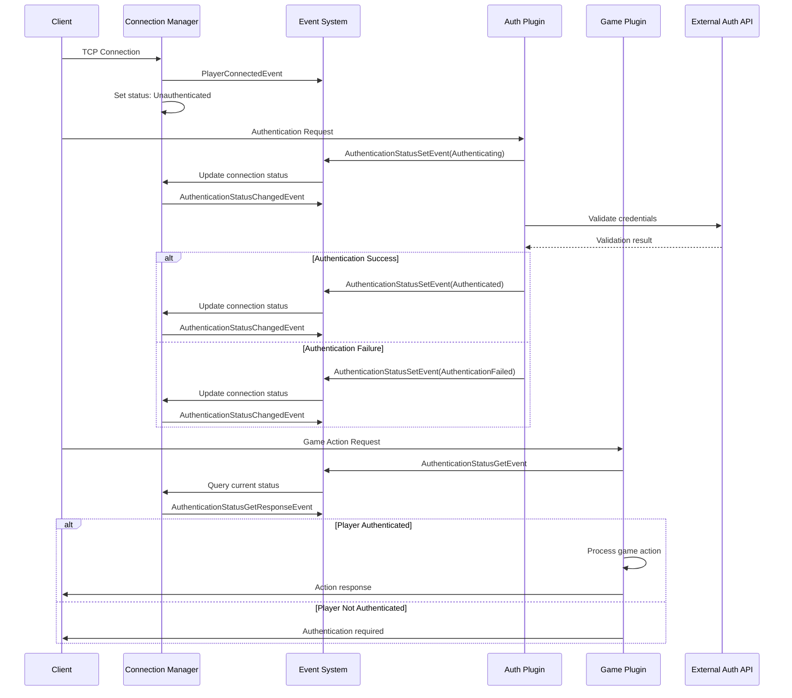

# Core Events and Connection Management in Horizon

Authentication forms the cornerstone of any multiplayer game server, yet implementing it correctly across a distributed plugin architecture presents unique challenges. Today, we're exploring a comprehensive enhancement to the Horizon game server framework that introduces a sophisticated authentication system built on core events and seamlessly integrated with connection management.

## The Distributed Authentication Challenge

Modern game servers aren't monolithic applications—they're ecosystems of specialized plugins, each handling distinct aspects of gameplay. A movement plugin validates player positions, a chat system manages communication, an economy plugin oversees virtual transactions, and inventory systems track player assets. Each of these components needs reliable access to authentication state, but traditional approaches create problematic coupling.

Consider the complexity: when a player attempts to trade an item, the economy plugin must verify their authentication status, check their inventory permissions, validate the trade partner's status, and ensure both players have sufficient privileges. Multiply this across dozens of plugins and hundreds of concurrent operations, and the need for a clean, efficient authentication system becomes clear.

We designed our event-driven authentication system to solve these challenges while maintaining the flexibility that makes plugin architectures powerful. Rather than forcing plugins to directly query connection state or maintain their own authentication caches, the system provides a unified event interface that handles the complexity behind the scenes.

## Core Authentication Events Architecture

The foundation of our authentication system rests on a carefully designed set of core events that handle the complete authentication lifecycle. These events provide a clean abstraction layer that separates authentication concerns from business logic:

```rust
#[derive(Debug, Clone, Serialize, Deserialize)]
pub struct AuthenticationStatusSetEvent {
    /// Unique identifier for the player
    pub player_id: PlayerId,
    /// The authentication status to set
    pub status: AuthenticationStatus,
    /// Unix timestamp when the status was set
    pub timestamp: u64,
}

#[derive(Debug, Clone, Serialize, Deserialize)]
pub struct AuthenticationStatusGetEvent {
    /// Unique identifier for the player
    pub player_id: PlayerId,
    /// Request ID for correlating responses
    pub request_id: String,
    /// Unix timestamp when the query was made
    pub timestamp: u64,
}

#[derive(Debug, Clone, Serialize, Deserialize)]
pub struct AuthenticationStatusGetResponseEvent {
    /// Unique identifier for the player
    pub player_id: PlayerId,
    /// Request ID for correlating with the original query
    pub request_id: String,
    /// Current authentication status (None if player not found)
    pub status: Option<AuthenticationStatus>,
    /// Unix timestamp when the response was generated
    pub timestamp: u64,
}
```

This event trio implements a complete request-response pattern that enables asynchronous authentication queries without blocking game operations. The request correlation system ensures responses can be properly matched to their originating queries, essential when handling thousands of concurrent authentication checks.

## Authentication State Model

We've defined four distinct authentication states that capture the complete player lifecycle from connection through authenticated gameplay:

```rust
#[derive(Debug, Clone, Copy, PartialEq, Eq, Serialize, Deserialize)]
pub enum AuthenticationStatus {
    /// Player is not authenticated
    Unauthenticated,
    /// Player is in the process of authenticating
    Authenticating,
    /// Player is successfully authenticated
    Authenticated,
    /// Player authentication failed
    AuthenticationFailed,
}

impl Default for AuthenticationStatus {
    fn default() -> Self {
        Self::Unauthenticated
    }
}
```

The `Unauthenticated` state represents a freshly connected client who hasn't begun authentication. This is the default state for new connections, ensuring a secure-by-default approach where access must be explicitly granted rather than assumed.

When authentication begins—whether through a login request, token validation, or external service verification—the status transitions to `Authenticating`. This intermediate state allows plugins to differentiate between players who haven't attempted authentication and those currently in the process.

Upon successful validation, the status becomes `Authenticated`, granting full access to game systems. If authentication fails at any point—due to invalid credentials, network issues, or service unavailability—the status moves to `AuthenticationFailed`. This explicit failure state enables sophisticated retry logic, cooldown periods, or automatic connection termination as appropriate for your game's security requirements.

## Enhanced Connection Management

The connection manager now tracks authentication status as a first-class citizen alongside traditional connection metadata. Each client connection maintains its authentication state, enabling efficient queries without expensive cross-system lookups:

```rust
#[derive(Debug)]
pub struct ClientConnection {
    /// The player ID assigned to this connection (None until assigned)
    pub player_id: Option<PlayerId>,
    /// The remote network address of the client
    pub remote_addr: SocketAddr,
    /// When this connection was established
    pub connected_at: SystemTime,
    /// Current authentication status of this connection
    pub auth_status: AuthenticationStatus,
}

impl ClientConnection {
    pub fn new(remote_addr: SocketAddr) -> Self {
        Self {
            player_id: None,
            remote_addr,
            connected_at: SystemTime::now(),
            auth_status: AuthenticationStatus::default(),
        }
    }

    pub fn auth_status(&self) -> AuthenticationStatus {
        self.auth_status
    }

    pub fn set_auth_status(&mut self, status: AuthenticationStatus) {
        self.auth_status = status;
    }
}
```

The connection manager provides both connection-based and player-based authentication status management to accommodate different operational patterns:

```rust
impl ConnectionManager {
    pub async fn set_auth_status(&self, connection_id: ConnectionId, status: AuthenticationStatus) {
        let mut connections = self.connections.write().await;
        if let Some(connection) = connections.get_mut(&connection_id) {
            connection.set_auth_status(status);
        }
    }

    pub async fn get_auth_status_by_player(&self, player_id: PlayerId) -> Option<AuthenticationStatus> {
        let connections = self.connections.read().await;
        for connection in connections.values() {
            if connection.player_id == Some(player_id) {
                return Some(connection.auth_status());
            }
        }
        None
    }

    pub async fn set_auth_status_by_player(&self, player_id: PlayerId, status: AuthenticationStatus) -> bool {
        let mut connections = self.connections.write().await;
        for connection in connections.values_mut() {
            if connection.player_id == Some(player_id) {
                connection.set_auth_status(status);
                return true;
            }
        }
        false
    }
}
```

This dual-access pattern serves different phases of the connection lifecycle. During initial connection handling, before player identification, you work with connection IDs. Once a player is identified and assigned an ID, subsequent operations can use the more convenient player-based methods that abstract away connection management complexity.

## Event Handler Implementation

The game server registers comprehensive event handlers that bridge the gap between the event system and connection management, implementing the core authentication business logic:

```rust
// Authentication status setter with change detection
let connection_manager_for_set = self.connection_manager.clone();
let horizon_event_system_for_set = self.horizon_event_system.clone();
self.horizon_event_system
    .on_core_async("auth_status_set", move |event: AuthenticationStatusSetEvent| {
        let conn_mgr = connection_manager_for_set.clone();
        let event_system = horizon_event_system_for_set.clone();
        async move {
            // Capture old status before making changes for change detection
            let old_status = conn_mgr.get_auth_status_by_player(event.player_id).await;
            
            let success = conn_mgr.set_auth_status_by_player(event.player_id, event.status).await;
            if success {
                info!("🔐 Updated auth status for player {} to {:?}", event.player_id, event.status);
                
                // Emit change notification only when status actually changes
                if let Some(old_status) = old_status {
                    if old_status != event.status {
                        let auth_status_changed_event = AuthenticationStatusChangedEvent {
                            player_id: event.player_id,
                            old_status,
                            new_status: event.status,
                            timestamp: current_timestamp(),
                        };
                        if let Err(e) = event_system.emit_core("auth_status_changed", &auth_status_changed_event).await {
                            warn!("⚠️ Failed to emit auth status changed event: {:?}", e);
                        }
                    }
                }
            } else {
                warn!("⚠️ Failed to update auth status for player {} - player not found", event.player_id);
            }
            Ok(())
        }
    })
    .await?;
```

This handler demonstrates several critical patterns. First, it captures the old authentication status before making changes, enabling proper change detection and preventing spurious notifications. Second, it only emits change events when the status actually changes, reducing event noise and improving system efficiency. The comprehensive error handling and logging aid in debugging authentication issues in production environments.

The query handler implements a complete request-response pattern that maintains the asynchronous nature of the system:

```rust
// Authentication status query with response correlation
let connection_manager_for_get = self.connection_manager.clone();
let horizon_event_system_for_get = self.horizon_event_system.clone();
self.horizon_event_system
    .on_core_async("auth_status_get", move |event: AuthenticationStatusGetEvent| {
        let conn_mgr = connection_manager_for_get.clone();
        let event_system = horizon_event_system_for_get.clone();
        async move {
            let status = conn_mgr.get_auth_status_by_player(event.player_id).await;
            
            // Emit correlated response event
            let response_event = AuthenticationStatusGetResponseEvent {
                player_id: event.player_id,
                request_id: event.request_id.clone(),
                status,
                timestamp: current_timestamp(),
            };
            
            if let Err(e) = event_system.emit_core("auth_status_get_response", &response_event).await {
                warn!("⚠️ Failed to emit auth status response: {:?}", e);
            } else {
                info!("🔍 Auth status query response for player {}: {:?} (request: {})", 
                      event.player_id, status, event.request_id);
            }
            Ok(())
        }
    })
    .await?;
```

The request-response pattern allows plugins to query authentication status asynchronously without blocking critical game operations. The request ID correlation system ensures responses can be matched to their originating queries, essential when handling concurrent operations from multiple plugins.

## Client Connection Enhancement

The client connection reference now includes authentication status, allowing handlers to make authentication-aware decisions without additional round-trip queries:

```rust
#[derive(Clone)]
pub struct ClientConnectionRef {
    pub player_id: PlayerId,
    pub remote_addr: SocketAddr,
    pub connection_id: String,
    pub connected_at: u64,
    /// Current authentication status of the connection
    pub auth_status: AuthenticationStatus,
    response_sender: Arc<dyn ClientResponseSender + Send + Sync>,
}

impl ClientConnectionRef {
    /// Checks if the connection is authenticated
    pub fn is_authenticated(&self) -> bool {
        self.auth_status == AuthenticationStatus::Authenticated
    }

    /// Gets the current authentication status of this connection
    pub fn auth_status(&self) -> AuthenticationStatus {
        self.auth_status
    }
}
```

This enhancement enables elegant authentication-aware patterns throughout the plugin ecosystem:

```rust
events.on_client("game", "move_request", |event: RawClientMessageEvent, client: ClientConnectionRef| {
    if !client.is_authenticated() {
        warn!("Rejecting move request from unauthenticated player: {}", client.player_id);
        return Ok(());
    }
    
    // Process authenticated movement request
    process_player_movement(&event, &client)?;
    Ok(())
}).await?;
```

## Authentication Workflow Visualization

The complete authentication flow demonstrates how events coordinate between system components:



This sequence demonstrates how the event system decouples authentication logic from game logic while maintaining clear communication paths and proper error handling throughout the system.

## Real-World Implementation: External Service Integration

The event-driven architecture particularly shines when integrating with existing authentication infrastructure. Game companies often have established account systems, OAuth providers, or custom authentication services that need to be integrated with new game servers. Our design makes this integration seamless and maintainable.

Here's a realistic authentication plugin that integrates with an external authentication API, demonstrating how the event system enables clean separation between game server logic and external service integration:

```rust
use horizon_event_system::{
    EventSystem, AuthenticationStatusSetEvent, AuthenticationStatusGetEvent,
    AuthenticationStatus, PlayerId, current_timestamp, RawClientMessageEvent
};
use serde::{Deserialize, Serialize};
use tokio::time::{timeout, Duration};
use std::sync::Arc;

/// External authentication service client
/// This represents integration with your existing account system
pub struct ExternalAuthService {
    base_url: String,
    api_key: String,
    client: reqwest::Client,
}

#[derive(Serialize)]
struct AuthValidationRequest {
    token: String,
    game_id: String,
}

#[derive(Deserialize)]
struct AuthValidationResponse {
    valid: bool,
    player_id: Option<String>,
    permissions: Vec<String>,
    expires_at: u64,
}

impl ExternalAuthService {
    pub fn new(base_url: String, api_key: String) -> Self {
        Self {
            base_url,
            api_key,
            client: reqwest::Client::new(),
        }
    }

    /// Validates a player token against the external authentication service
    /// This might be your existing OAuth provider, custom auth API, or third-party service
    async fn validate_token(&self, token: &str) -> Result<AuthValidationResponse, Box<dyn std::error::Error + Send + Sync>> {
        let request = AuthValidationRequest {
            token: token.to_string(),
            game_id: "horizon_game_v1".to_string(),
        };

        let response = timeout(Duration::from_secs(5), 
            self.client
                .post(&format!("{}/auth/validate", self.base_url))
                .header("Authorization", &format!("Bearer {}", self.api_key))
                .header("Content-Type", "application/json")
                .json(&request)
                .send()
        ).await??;

        if !response.status().is_success() {
            return Err(format!("Authentication service returned status: {}", response.status()).into());
        }

        let auth_response: AuthValidationResponse = response.json().await?;
        Ok(auth_response)
    }
}

/// Authentication plugin that handles integration with external services
/// This design allows you to swap authentication providers without touching game logic
pub struct AuthenticationPlugin {
    event_system: Arc<EventSystem>,
    auth_service: ExternalAuthService,
    database_pool: sqlx::PgPool, // Your existing database connection
}

impl AuthenticationPlugin {
    pub fn new(
        event_system: Arc<EventSystem>, 
        auth_service: ExternalAuthService,
        database_pool: sqlx::PgPool
    ) -> Self {
        Self {
            event_system,
            auth_service,
            database_pool,
        }
    }

    /// Initialize the authentication plugin by registering event handlers
    pub async fn initialize(&self) -> Result<(), Box<dyn std::error::Error + Send + Sync>> {
        // Handle login requests from clients
        let auth_service = self.auth_service.clone();
        let event_system = self.event_system.clone();
        let db_pool = self.database_pool.clone();
        
        self.event_system.on_client("auth", "login", move |event: RawClientMessageEvent, _client| {
            let auth_service = auth_service.clone();
            let event_system = event_system.clone();
            let db_pool = db_pool.clone();
            
            async move {
                // Parse login data from client
                let login_data: serde_json::Value = serde_json::from_slice(&event.data)
                    .map_err(|e| format!("Invalid login data: {}", e))?;
                
                let token = login_data["token"].as_str()
                    .ok_or("Missing authentication token")?;

                // Set status to authenticating immediately
                event_system.emit_core("auth_status_set", &AuthenticationStatusSetEvent {
                    player_id: event.player_id,
                    status: AuthenticationStatus::Authenticating,
                    timestamp: current_timestamp(),
                }).await.map_err(|e| format!("Failed to set authenticating status: {}", e))?;

                // This is where the magic happens - external service integration
                match auth_service.validate_token(token).await {
                    Ok(auth_response) if auth_response.valid => {
                        // Update player data in your existing database
                        if let Some(external_player_id) = auth_response.player_id {
                            let _ = sqlx::query!(
                                "INSERT INTO player_sessions (internal_player_id, external_player_id, permissions, expires_at) 
                                 VALUES ($1, $2, $3, $4)
                                 ON CONFLICT (internal_player_id) DO UPDATE SET 
                                 external_player_id = $2, permissions = $3, expires_at = $4",
                                event.player_id.to_string(),
                                external_player_id,
                                &auth_response.permissions,
                                auth_response.expires_at as i64
                            ).execute(&db_pool).await;
                        }

                        // Set authentication status to authenticated
                        event_system.emit_core("auth_status_set", &AuthenticationStatusSetEvent {
                            player_id: event.player_id,
                            status: AuthenticationStatus::Authenticated,
                            timestamp: current_timestamp(),
                        }).await.map_err(|e| format!("Failed to set authenticated status: {}", e))?;
                        
                        info!("🎉 Player {} successfully authenticated via external service", event.player_id);
                    },
                    Ok(_auth_response) => {
                        // Token was processed but marked as invalid
                        event_system.emit_core("auth_status_set", &AuthenticationStatusSetEvent {
                            player_id: event.player_id,
                            status: AuthenticationStatus::AuthenticationFailed,
                            timestamp: current_timestamp(),
                        }).await.map_err(|e| format!("Failed to set failed status: {}", e))?;
                        
                        warn!("🔒 Authentication failed for player {} - invalid token", event.player_id);
                    },
                    Err(e) => {
                        // Network error, service unavailable, etc.
                        event_system.emit_core("auth_status_set", &AuthenticationStatusSetEvent {
                            player_id: event.player_id,
                            status: AuthenticationStatus::AuthenticationFailed,
                            timestamp: current_timestamp(),
                        }).await.map_err(|e| format!("Failed to set failed status: {}", e))?;
                        
                        error!("❌ Authentication service error for player {}: {}", event.player_id, e);
                    }
                }
                
                Ok(())
            }
        }).await?;

        // Handle session refresh/validation requests
        let db_pool = self.database_pool.clone();
        self.event_system.on_client("auth", "refresh", move |event: RawClientMessageEvent, client| {
            let db_pool = db_pool.clone();
            async move {
                // Only allow refresh if currently authenticated
                if !client.is_authenticated() {
                    warn!("🔒 Refresh attempt from unauthenticated player: {}", client.player_id);
                    return Ok(());
                }

                // Check session expiration in database
                let session = sqlx::query!(
                    "SELECT expires_at FROM player_sessions WHERE internal_player_id = $1",
                    event.player_id.to_string()
                ).fetch_optional(&db_pool).await.map_err(|e| format!("Database error: {}", e))?;

                if let Some(session) = session {
                    let now = current_timestamp();
                    if session.expires_at < now as i64 {
                        // Session expired - this could trigger re-authentication
                        warn!("⏰ Session expired for player {}", client.player_id);
                        // Could emit AuthenticationStatusSetEvent with AuthenticationFailed here
                    }
                }

                Ok(())
            }
        }).await?;

        info!("🚀 Authentication plugin initialized with external service integration");
        Ok(())
    }
}

/// Game plugin demonstrating authentication-aware game logic
pub struct GameLogicPlugin {
    event_system: Arc<EventSystem>,
}

impl GameLogicPlugin {
    pub async fn initialize(&self) -> Result<(), Box<dyn std::error::Error + Send + Sync>> {
        // Trade system that requires authentication
        self.event_system.on_client("economy", "initiate_trade", |event: RawClientMessageEvent, client| {
            async move {
                // Immediate authentication check without external calls
                if !client.is_authenticated() {
                    warn!("🚫 Trade request rejected - player {} not authenticated", client.player_id);
                    // Could send error response to client here
                    return Ok(());
                }

                // For critical operations, you might want to double-check auth status
                // This demonstrates the query pattern for high-value operations
                let request_id = format!("trade_auth_check_{}", uuid::Uuid::new_v4());
                
                // This would typically be handled by a different component that waits for the response
                info!("💰 Processing trade request from authenticated player {}", client.player_id);
                
                Ok(())
            }
        }).await?;

        // Chat system with authentication requirement
        self.event_system.on_client("chat", "send_message", |event: RawClientMessageEvent, client| {
            async move {
                match client.auth_status() {
                    AuthenticationStatus::Authenticated => {
                        info!("💬 Processing chat message from player {}", client.player_id);
                        // Process chat message
                    },
                    AuthenticationStatus::Authenticating => {
                        info!("⏳ Chat message queued - player {} still authenticating", client.player_id);
                        // Could queue message for processing after authentication
                    },
                    _ => {
                        warn!("🔇 Chat message rejected - player {} not authenticated", client.player_id);
                        // Send authentication required response
                    }
                }
                Ok(())
            }
        }).await?;

        Ok(())
    }
}
```

This implementation demonstrates several key architectural benefits of our event-driven approach:

**Clean External Service Integration**: The authentication plugin encapsulates all external service communication, making it easy to swap providers or handle service outages without affecting game logic.

**Database Integration**: The plugin seamlessly integrates with existing database schemas, allowing you to maintain player session data and permissions in your established infrastructure.

**Timeout and Error Handling**: Network operations include proper timeouts and comprehensive error handling, ensuring external service issues don't destabilize the game server.

**Separation of Concerns**: Game logic plugins can focus purely on gameplay mechanics while trusting the authentication system to handle security concerns.

**Immediate Response Capability**: The cached authentication status in connection references allows plugins to make instant authentication decisions without waiting for database queries or external service calls.

## Testing Strategy

The implementation includes extensive integration tests that verify the complete authentication workflow under various scenarios:

```rust
#[tokio::test]
async fn test_complete_auth_workflow() {
    let connection_manager = Arc::new(ConnectionManager::new());
    
    // Simulate realistic connection flow
    let remote_addr: SocketAddr = "127.0.0.1:54321".parse().unwrap();
    let connection_id = connection_manager.add_connection(remote_addr).await;
    let player_id = PlayerId::new();
    
    // Step 1: Fresh connection should be unauthenticated
    let initial_status = connection_manager.get_auth_status(connection_id).await;
    assert_eq!(initial_status, Some(AuthenticationStatus::Unauthenticated));
    
    // Step 2: Player identification and authentication start
    connection_manager.set_player_id(connection_id, player_id).await;
    connection_manager.set_auth_status_by_player(player_id, AuthenticationStatus::Authenticating).await;
    
    let status = connection_manager.get_auth_status_by_player(player_id).await;
    assert_eq!(status, Some(AuthenticationStatus::Authenticating));
    
    // Step 3: Successful authentication
    connection_manager.set_auth_status_by_player(player_id, AuthenticationStatus::Authenticated).await;
    
    let final_status = connection_manager.get_auth_status_by_player(player_id).await;
    assert_eq!(final_status, Some(AuthenticationStatus::Authenticated));
    
    // Step 4: Verify connection persistence and correct status propagation
    let connection_exists = connection_manager.get_connection_id_by_player(player_id).await;
    assert!(connection_exists.is_some());
    
    let status_via_connection = connection_manager.get_auth_status(connection_exists.unwrap()).await;
    assert_eq!(status_via_connection, Some(AuthenticationStatus::Authenticated));
}

#[tokio::test]
async fn test_auth_failure_scenarios() {
    let connection_manager = Arc::new(ConnectionManager::new());
    let nonexistent_player = PlayerId::new();
    
    // Querying nonexistent player should return None
    let status = connection_manager.get_auth_status_by_player(nonexistent_player).await;
    assert_eq!(status, None);
    
    // Setting status for nonexistent player should fail gracefully
    let success = connection_manager.set_auth_status_by_player(
        nonexistent_player, 
        AuthenticationStatus::Authenticated
    ).await;
    assert!(!success);
}
```

These tests ensure the authentication system behaves correctly under both normal and edge case scenarios, providing confidence in production deployments.

## Performance Characteristics and Scalability

The authentication system is designed for high-performance operation under significant load. Authentication status is cached directly in connection structures, providing O(1) lookup times for authenticated status checks. The event system provides natural backpressure handling, preventing authentication bottlenecks from cascading throughout the system.

Connection-based lookups operate in constant time, while player-based queries scale linearly with the number of connections. For servers supporting thousands of concurrent players, this design maintains excellent performance characteristics while providing the flexibility needed for complex authentication workflows.

The asynchronous event system ensures that external service integration doesn't block game operations. Authentication requests can be processed concurrently while other plugins continue handling game logic, maintaining responsive gameplay even during authentication spikes.

## Security Considerations and Best Practices

The secure-by-default design ensures new connections start in an unauthenticated state, requiring explicit authentication before gaining access to game systems. The authentication status cache prevents time-of-check-time-of-use vulnerabilities by providing consistent state across plugin operations.

Event correlation through request IDs prevents authentication response spoofing and ensures responses are properly matched to their originating requests. The comprehensive logging throughout the authentication flow aids in security monitoring and incident response.

External service integration includes proper timeout handling to prevent denial-of-service scenarios where slow authentication providers could overwhelm the game server. The modular design makes it straightforward to implement additional security measures like rate limiting, audit logging, or multi-factor authentication.

## Future Enhancement Roadmap

While this implementation provides a robust foundation, several enhancements are planned for future releases. Session management could track authentication expiration and automatic renewal, reducing friction for players while maintaining security. Advanced privilege systems could extend the basic authenticated/unauthenticated model to support role-based access control and fine-grained permissions.

Rate limiting could prevent brute force attacks by tracking failed authentication attempts per connection or IP address. The event correlation system could be enhanced to provide better tracking of complex authentication flows involving multiple steps or external services.

Comprehensive metrics collection could provide insights into authentication performance, security patterns, and player behavior. Integration with monitoring systems would enable automated alerting for authentication anomalies or service degradation.

## Developer Impact

The new authentication system in Horizon demonstrates how thoughtful architecture can elegantly solve complex distributed systems challenges. By leveraging events for communication and maintaining clear separation between authentication logic and connection management, we've created a system that's simultaneously powerful and maintainable.

The type-safe event system ensures reliability while the plugin architecture provides unlimited flexibility. Connection management integration delivers excellent performance characteristics while comprehensive testing ensures correctness under all scenarios. Most importantly, the clean integration patterns with external services make it straightforward to incorporate existing authentication infrastructure without architectural compromises.

For developers building on Horizon, this authentication system provides the tools needed to implement secure, scalable player authentication without getting overwhelmed by the complexities of distributed state management. The clean APIs, comprehensive documentation, and realistic examples make it easy to integrate authentication into any plugin while maintaining the high performance standards expected from a game server framework.

The event-driven approach particularly benefits teams with existing authentication infrastructure, allowing seamless integration with OAuth providers, custom authentication services, or legacy account systems. The modular design ensures that authentication concerns remain cleanly separated from game logic, making both easier to maintain and evolve over time.

This foundation will support increasingly sophisticated authentication requirements as Horizon continues to evolve, providing game developers with the security and flexibility they need to build engaging, secure multiplayer experiences.